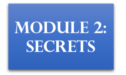

# Serverless Security Workshop

In this workshop, you will learn techniques to secure a serverless application built with AWS Lambda, Amazon API Gateway and RDS Aurora. We will cover AWS services and features you can leverage to improve the security of a serverless applications in 5 domains: 

1. identity & access management
1. infrastructure
1. data
1. code
1. logging & monitoring

You'll start by deploying a simple serverless application that allows third party companies to submit unicorn customizations. This will help Wild Rydes receive ad revenue and allow  third party companies to market their brand leveraging Wild Rydes's popularity. 

The simple serverless application has the below architecture to start with:

However, this simple serverless application is not very secure, and we need your help to implement measures to protect this serverless API from attackers. 

By following different modules covering various aspects of security, you will help improve the security of the simple serverless application. 

## Presentation Slides
You can find the presentation slides in the `slides` branch of this git repo, under the `presentation/` folder

## Workshop Modules

**Note**: The workshop is designed so you don't have to complete all the modules in order, with the exception of module 0:  You must start with module 0 before you work on other modules!

Click on the link to module 0 below to get started deploying the simple serverless application that you will spend the rest of the workshop securing! 

Here's an overview of the modules in this workshop and how they map to different areas of security:

<table style="text-align:center width:100%" align="center" >
  <tr>
    <th rowspan="3" width="20%"> 
    	Identity & Access ⚔   
    	
	 </th>
    <th width="60%">
    	Code 🏰   
    	
    	
    	
    </th>
    <th width="20%" colspan="3" rowspan="3">Logging & Monitoring 🕶
    	
</th>
  </tr>
  <tr >
    <td align="center" width="60%">
    	Data 🏆  	    
    	
    </td>
  </tr>
  <tr>
    <td align="center" width="60%">Infrastructure 🛡  
 		
  		
	</td>
    </tr>
</table>

## Resource cleanup

Click below to go to the resource cleanup steps: 

## License Summary

The documentation is made available under the Creative Commons Attribution-ShareAlike 4.0 International License. See the LICENSE file.

The sample 
within this documentation is made available under a modified MIT license. See the LICENSE-SAMPLECODE file.
