# Module 0: Initial Setup

In this set up module, you will deploy a simple serverless application, which you will learn to secure in the following modules. You will create an REST API endpoint so partner companies of Wild Rydes can submit unicorn customizations such as branded socks and capes to advertise their company. Below is a high level architecture of what you will be deploying: 

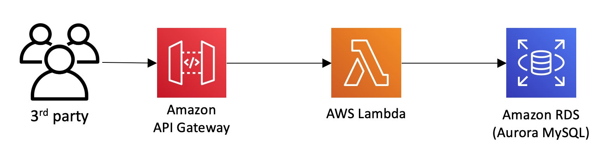


## Prerequisites

If you are completing this workshop at an AWS-sponsored event where an AWS account is provided for you, you will be using **AWS Event Engine**. In this case, the prerequisites is already met and you can move on to next step. 

If you not not using AWS Event Engine, expand below to see prerequisites: 

<details>
<summary><strong> Prerequisites if you are not using AWS Event Engine </strong></summary><p>


### AWS Account
In order to complete this workshop, you'll need an AWS account and access to create and manage the AWS resources that are used in this workshop, including Cloud9, Cognito, API Gateway, Lambda, RDS, WAF, Secrets Manager, and IAM policies and roles.

The code and instructions in this workshop assume only one participant is using a given AWS account at a time. If you attempt sharing an account with another participant, you may encounter naming conflicts for certain resources. You can work around this by using distinct Regions, but the instructions do not provide details on the changes required to make this work.

Please make sure not to use a production AWS environment or account for this workshop. It is recommended to instead use a **development account** which provides **full access** to the necessary services so that you do not run into permissions issues.


### Region Selection
Use a single region for the entirety of this workshop. This workshop supports two regions in North America and 1 region in Europe. Choose one region from the launch stack links below and continue to use that region for all of the workshop activities.

</details>

## Module-0A: Create a VPC and Cloud9 environment required for this workshop

A VPC is required for our workshop so we can:

* Leverage a Cloud9 environment as our IDE (integrated development environment)
* Use an RDS Aurora MySQL database as the backend database for our serverless application. 

A CloudFormation setup has been prepared to spin up these resources:

* A **VPC** with 4 subnets, 2 private and 2 public. 
* A **Cloud9** environment where you will be developing and launching the rest of the workshop resources from.
* A **MySQL Aurora RDS database** (the primary DB instance may reside in either of the 2 private subnets)

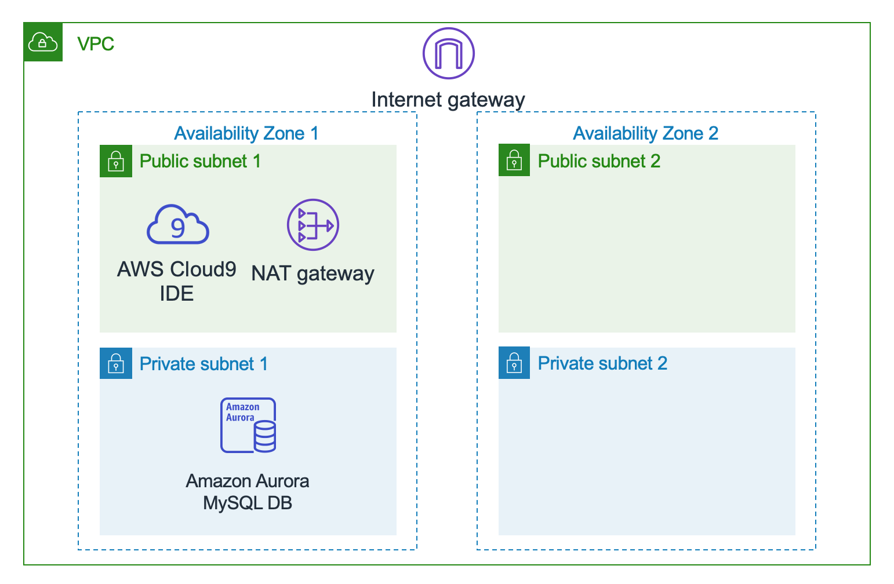


In addition, it also creates the below resources

* A **S3 bucket** you will later use for packaging and uploading lambda function code 
* A **Security Group** that will be used by the lambda functions

**Choose and click on the option below according to your situation and follow its instructions:**

If you are completing this workshop at an AWS-sponsored event where an AWS account is provided for you, you will be using **AWS Event Engine**. Choose **Option 1** below. Otherwise, choose **Option 2**. 
<details>
<summary><strong> Option 1: If you are using AWS Event Engine </strong></summary><p>
If you are using AWS Event Engine, an AWS CloudFormation stack should be automatically created for you.
 
 
1. Go to [https://dashboard.eventengine.run](https://dashboard.eventengine.run)
1. In the next screen, put in the hash code you received from the event organizer, and click **Proceed**

   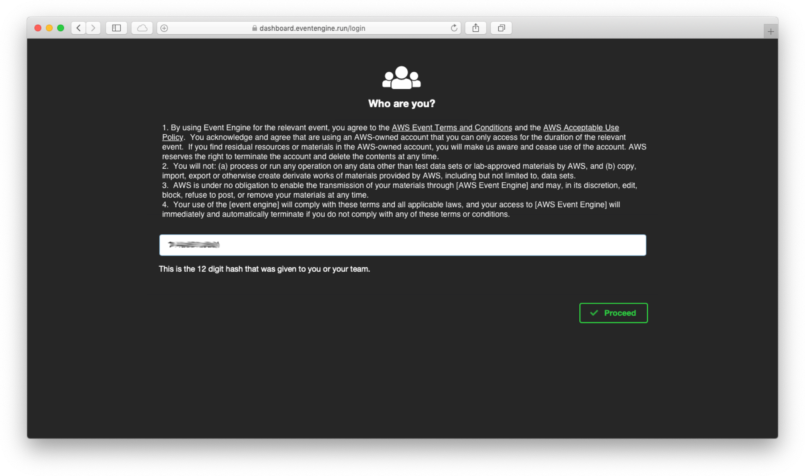

1. Log into the the AWS console in the event engine account by clicking on **AWS Console**

   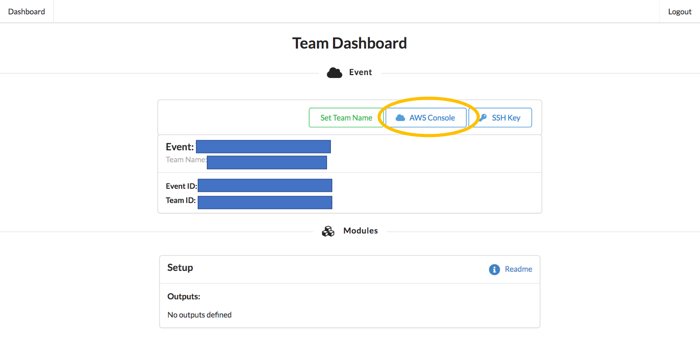

1. Click on **Open AWS Console** or use the **Copy Login Link** button and open the copied URL in **Chrome** or **Firefox**
    
    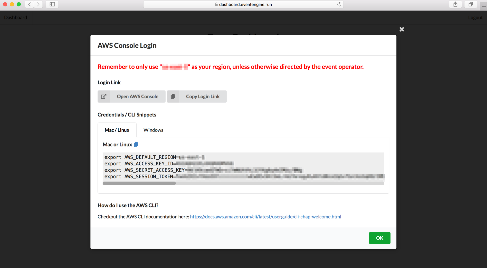
    
1. Type in `CloudFormation` in the **Find Services** search bar to go to the CloudFormation console
1. You should see 2 stacks that have been created:
   * one named something like `mod-3269ecbd5edf43ac` This is the ***main setup stack*** containing the setup resources.
   * one with name similar to `aws-cloud9-Secure-Serverless-Cloud9-<alphanumeric-letters>`. This is a nested stack responsible for creating the Cloud9 environment.
1. Select the ***main setup stack*** (name starting with `mod-`), go to the **Outputs** tab. Keep this browser tab open as you go through rest of the workshop. 

    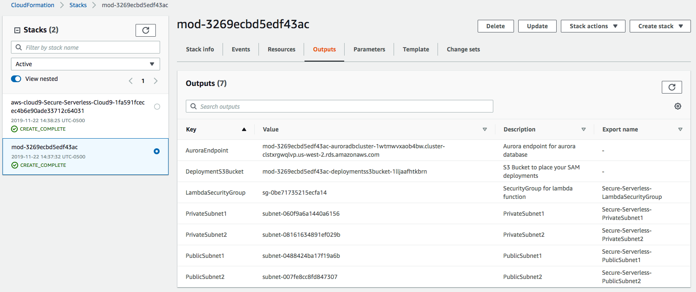
    
</details>

<details>
<summary><strong> Option 2: If you are working in your own AWS account</strong></summary><p>


If you are working in your own AWS account, follow the steps below to launch a CloudFormation template that will set up initial resources for you

1. Select the desired region. Since we are going to use services like Aurora or Cloud9, please choose one of these following and click the corresponding **Launch Stack** link

	&#128161; **When clicking on any link in this instruction, hold the ⌘ (mac) or Ctrl (Windows) so the links open in a new tab** &#128161;

	Region| Code | Launch
	------|------|-------
	EU (Ireland) | <span style="font-family:'Courier';">eu-west-1</span> | [](https://console.aws.amazon.com/cloudformation/home?region=eu-west-1#/stacks/new?stackName=Secure-Serverless&templateURL=https://s3.amazonaws.com/wildrydes-us-east-1/Security/init-template.yml)
	US West (Oregon) | <span style="font-family:'Courier';">us-west-2</span> | [](https://console.aws.amazon.com/cloudformation/home?region=us-west-2#/stacks/new?stackName=Secure-Serverless&templateURL=https://s3.amazonaws.com/wildrydes-us-east-1/Security/init-template.yml)
	US East (N. Virginia) | <span style="font-family:'Courier';">us-east-1</span> | [](https://console.aws.amazon.com/cloudformation/home?region=us-east-1#/stacks/new?stackName=Secure-Serverless&templateURL=https://s3.amazonaws.com/wildrydes-us-east-1/Security/init-template.yml)

1. 	Click **Next**
1. In the **Step 2: Specify stack details** page:
	* name you stack ***`Secure-Serverless`***
	* for the database password, use ***`Corp123!`***
	and click **Next**
	
		> Note: you can specify a different password here if you prefer. However, the password must be at least 8 character long.  And if you do this, you would later need to change the lambda function code in module-0D to use the password you specified in the `src/app/dbUtils.js` file.
	
1. In the **Step 3:Configure stack options** page, accept the default configurations and click **Next**
1. Review the configuration and click **Create stack**
1. While you are waiting for the completion of the CloudFormation stack creation, check if you have **PostMan** installed on your laptop. If not, download and install it at: [https://www.getpostman.com](https://www.getpostman.com), we will need to use it later. 

1. It will take a few minutes for the Stack to create. Choose the **Stack Info** tab to go to the overall stack status page and wait until the stack is fully launched and shows a status of *CREATE_COMPLETE*. Click the refresh icon periodically to see progress update.

	> Note: When you launch the stack, CloudFormation deploys a nested CloudFormation stack to launch the Cloud9 resources. You can safely ignore that template which is prefixed with "aws-cloud9-Secure-Serverless-".

1. Once the CloudFormation creation completes, go to the **Outputs** tab and copy the **AuroraEndpoint** to a text editor. You will need it to connect to the Aurora database in the next step. (**Keeping this browser tab open throughout this workshop is also highly recommended**)

	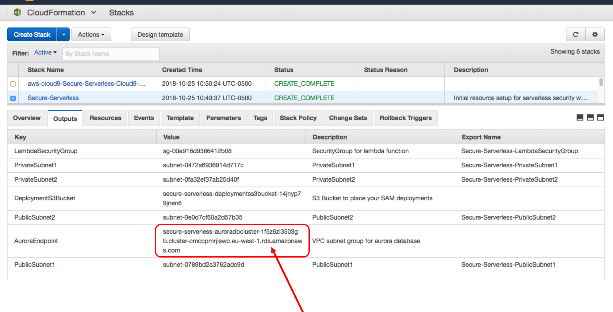

</details>


## Module-0B: Access Cloud9

As part of the above step, an [Cloud9 IDE instance](https://aws.amazon.com/cloud9/) is created. All of the coding and commands in this workshop should be run inside the Cloud9 IDE environment. 
 
1. Open a new browser tab and go to the Cloud9 console: `https://console.aws.amazon.com/cloud9/home` (You can also find the Cloud9 console in the AWS console by clicking on **Services** in the navigation bar on the top, and search for `cloud9` and enter)

1. Click on ***Your environments*** (you may need to expand the left sidebar) 

	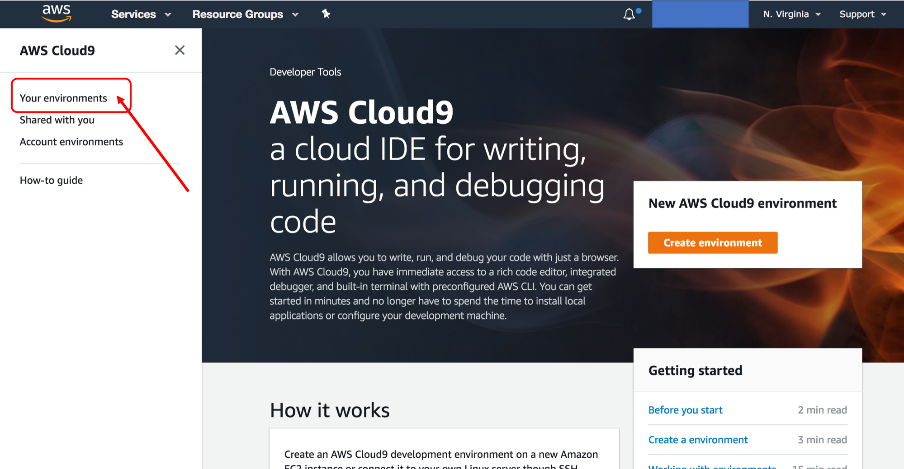

1. Under the *Secure-Serverless-Cloud9* environment, click on ***Open IDE***
	
	

	If you have trouble opening cloud9, ensure you are using:
	
	* Either  **Chrome** or **Firefox** browser 
	* Refer to the troubleshooting guide [**here**](https://docs.aws.amazon.com/cloud9/latest/user-guide/troubleshooting.html#troubleshooting-env-loading) to ensure third-party cookies is enabled 

1. You should now see an integrated development environment (IDE) environment as shown below. AWS Cloud9 is a cloud-based IDE that lets you write, run, and debug your code with just a browser. You can run shell commands in the terminal section just like you would on your local computers

	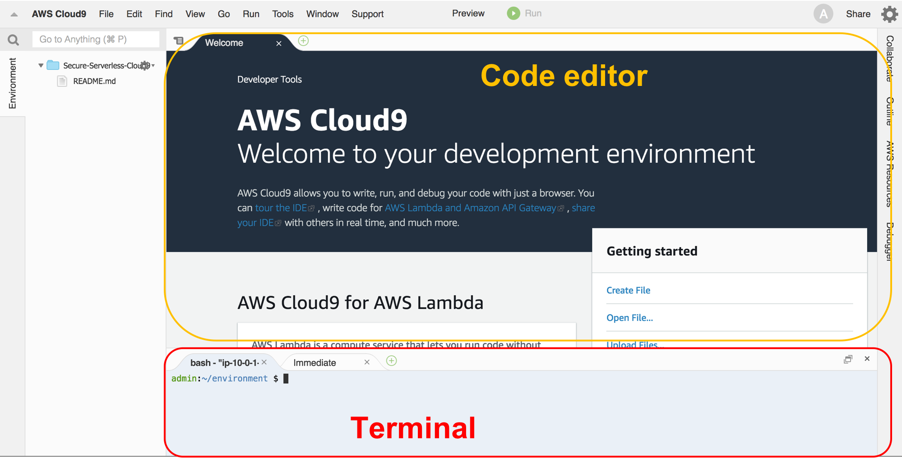

	Keep your AWS Cloud9 IDE opened in a tab throughout this workshop as you'll be using it for most all activities.

1. We need to get the content of this workshop in this environment. In the Cloud9 terminal window, run the following command to clone this repository (bottom of the page):

	`git clone https://github.com/aws-samples/aws-serverless-security-workshop.git`

    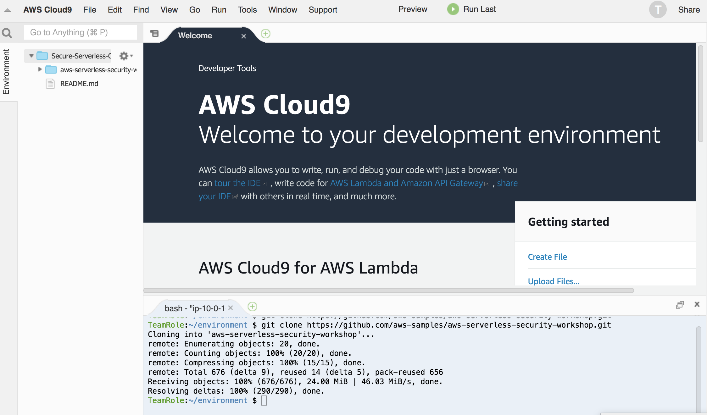

:bulb:**Tip:**  Keep an open scratch pad in Cloud9 for notes on resource IDs, etc. that you will need for future steps: 

1.  Create a new file in Cloud9  

    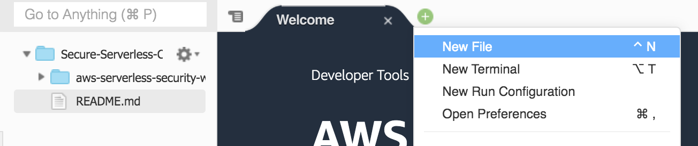

1.  Copy/paste the resource IDs from the browser tab with the CloudFormation console open, copy the content under **Outputs**, and save it as `scratch.txt`

    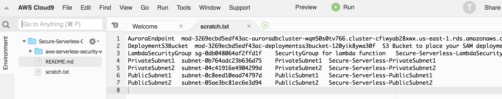
    

## Module-0C: Prepare your database

We need to create some tables and insert some initial values to the Aurora database. In Module-0A, a Aurora database is setup in private subnet so the database is not reachable directly from the Internet. 

Because your Cloud9 instance and the Aurora database is in the same VPC, you can administer the database from the Cloud9 instance (The security group of the database the have been configured to allow the traffic):

To initialize your database:

1. In the cloud9 terminal window, go into the folder of the repo:

 	```
 	cd aws-serverless-security-workshop/
 	```

    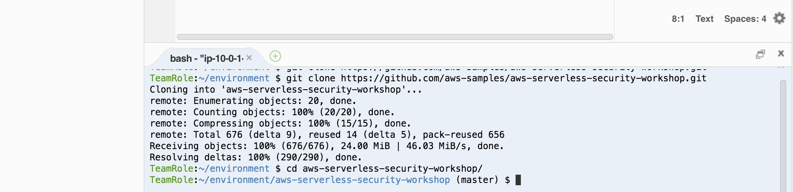

1. Connect to your cluster with the following command. Replace the Aurora endpoint with the one you copied into your scratch pad.

	`mysql -h <YOUR-AURORA-SERVERLESS-ENDPOINT> -u admin -p`

	You should be prompted with a password. Use *`Corp123!`* (If during Module-0A, you customized the password to something else, use the one you specified).

1. Within the mysql command prompt (`mysql> `), enter the following command: 

	`source src/init/db/queries.sql`
	
	You should see an output such as this:
	
	``` bash
	mysql> source src/init/db/queries.sql
	Query OK, 1 row affected (0.01 sec)
	
	Database changed
	Query OK, 0 rows affected (0.02 sec)
	
	Query OK, 0 rows affected (0.02 sec)
	
	Query OK, 0 rows affected (0.02 sec)
	
	Query OK, 0 rows affected (0.02 sec)
	
	Query OK, 0 rows affected (0.02 sec)
	
	Query OK, 0 rows affected (0.03 sec)
	
	Query OK, 1 row affected, 1 warning (0.00 sec)
	
	Query OK, 2 rows affected (0.01 sec)
	Records: 2  Duplicates: 0  Warnings: 0
	
	Query OK, 8 rows affected (0.01 sec)
	Records: 8  Duplicates: 0  Warnings: 0
	
	Query OK, 7 rows affected (0.00 sec)
	Records: 7  Duplicates: 0  Warnings: 0
	
	Query OK, 4 rows affected (0.00 sec)
	Records: 4  Duplicates: 0  Warnings: 0
		
	mysql> 
	```

1. You can explore the database tables created by running the following SQL query:
	
	```sql 
	SHOW tables;
	```

	You should see something like this

	```sql 
	mysql> SHOW tables;
	+---------------------------------+
	| Tables_in_unicorn_customization |
	+---------------------------------+
	| Capes                           |
	| Companies                       |
	| Custom_Unicorns                 |
	| Glasses                         |
	| Horns                           |
	| Socks                           |
	+---------------------------------+
	6 rows in set (0.00 sec)
	```

	Explore the content of the tables using 
	
	```sql 
	SELECT * FROM Capes;
	```

	You should see something like this
	
	```sql
	mysql> SELECT * FROM Capes;
	+----+--------------------+-------+
	| ID | NAME               | PRICE |
	+----+--------------------+-------+
	|  1 | White              |  0.00 |
	|  2 | Rainbow            |  2.00 |
	|  3 | Branded on White   |  3.00 |
	|  4 | Branded on Rainbow |  4.00 |
	+----+--------------------+-------+
	4 rows in set (0.00 sec)
	```

1. After that, you can use the command `exit` to drop the mysql connection.

## Module-0D: The starting code for the serverless application

The code for the lambda functions resides within the path `aws-serverless-security-workshop/src/app`. The first thing you need to do is install node dependencies by navigating to this folder and using the following command: 
	
```sh
$ cd ~/environment/aws-serverless-security-workshop/src/app
$ npm install
```
	
> Note: If you see this warning
> 
> 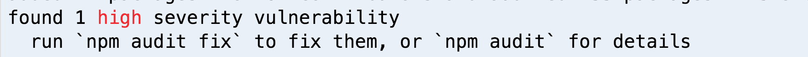
> 
> Don't worry. We will be addressing the dependency vulnerability in [**module 7**](../07-dependency-vulnerability/README.md) :) 
	
The `src/app` folder has a few files: 
	
- **unicornParts.js**: Main file for the lambda function that lists unicorn customization options.  
- **customizeUnicorn.js**: Main file for the lambda function that handles the create/describe/delete operations for a unicorn customization configuration.
- **dbUtils.js**: This file contains all the database/query logic of the application. It also contains all the connection requirements in plain text (that's suspicious!)


Review them by navigating the file explorer sidebar in Cloud9:

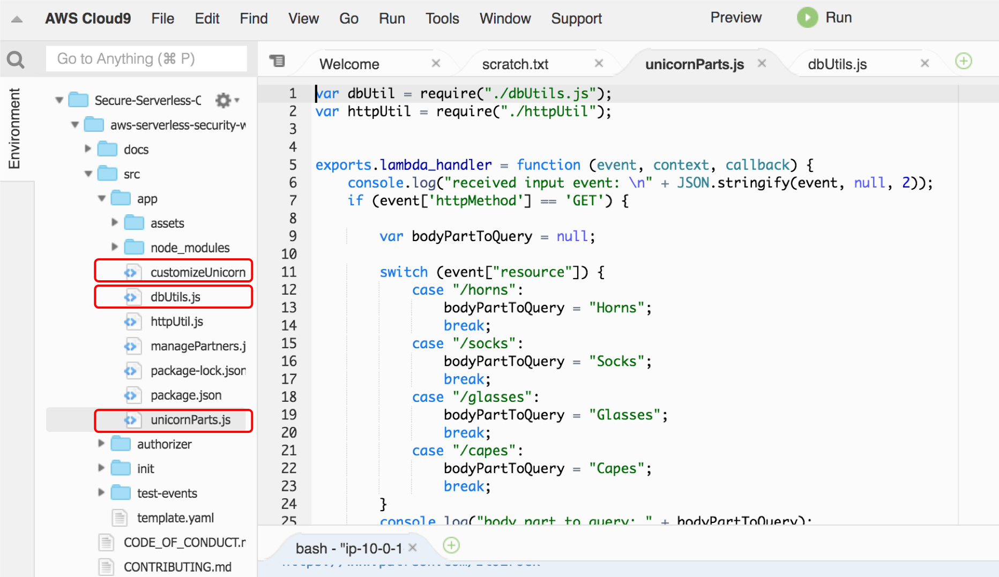


In addition, these additional files reside in the folder. No need to review them closely at this point:

- **httpUtils.js**: This file contains the http response logic from your application.
- **managePartners.js**: Main file for the lambda function that handles the logic to register a new partner company. We will go into details on this one in Module 1. 
- **package.json**: Nodejs project manifest, including listing dependencies of the code 

In addition to the lambda code, the configurations for Lambda function and the REST APIs are spelled out in `template.yaml` as a **AWS SAM** (Serverless Application Model) template. 

[AWS SAM](https://github.com/awslabs/serverless-application-model) allows you to define serverless applications in simple and clean syntax. In the `template.yaml`, you can see we have defined 3 lambda functions, and it maps to a set of REST APIs defined in a Swagger template: 

<table>
  <tr>
    <th>Lambda Function</th>
    <th>Main handler code</th>
    <th>API resource</th>
    <th>HTTP Verb</th>
    <th>Description</th>
  </tr>
  <tr>
    <td rowspan="4">UnicornPartsFunction</td>
    <td rowspan="4">unicornParts.js</td>
    <td>/horns</td>
    <td>GET</td>
    <td>List customization options for horns</td>
  </tr>
  <tr>
    <td>/glasses</td>
    <td>GET</td>
    <td>List customization options for glasses</td>
  </tr>
  <tr>
    <td>/socks</td>
    <td>GET</td>
    <td>List customization options for socks</td>
  </tr>
  <tr>
    <td>/capes</td>
    <td>GET</td>
    <td>List customization options for capes</td>
  </tr>
  <tr>
    <td rowspan="4">CustomizeUnicornFunction</td>
    <td rowspan="4">customizeUnicorn.js</td>
    <td>/customizations</td>
    <td>POST</td>
    <td>Create unicorn customization</td>
  </tr>
  <tr>
    <td>/customizations</td>
    <td>GET</td>
    <td>List unicorn customization</td>
  </tr>
  <tr>
    <td>/customizations/{id}</td>
    <td>GET</td>
    <td>Describe a unicorn customization</td>
  </tr>
  <tr>
    <td>/customizations/{id}</td>
    <td>DELETE</td>
    <td>Delete a unicorn customization</td>
  </tr>
  <tr>
    <td>ManagePartnerFunction</td>
    <td>managePartners.js</td>
    <td>/partners</td>
    <td>POST</td>
    <td>Register a new partner company</td>
  </tr>
</table>

## Module-0E: Run your serverless application locally with SAM Local

1. After reviewing the code, under **src/app/dbUtils.js**, replace the *host* with the Aurora endpoint. Then save the file (⌘+s for Mac or Ctrl+s for Windows or File -> Save)
   
   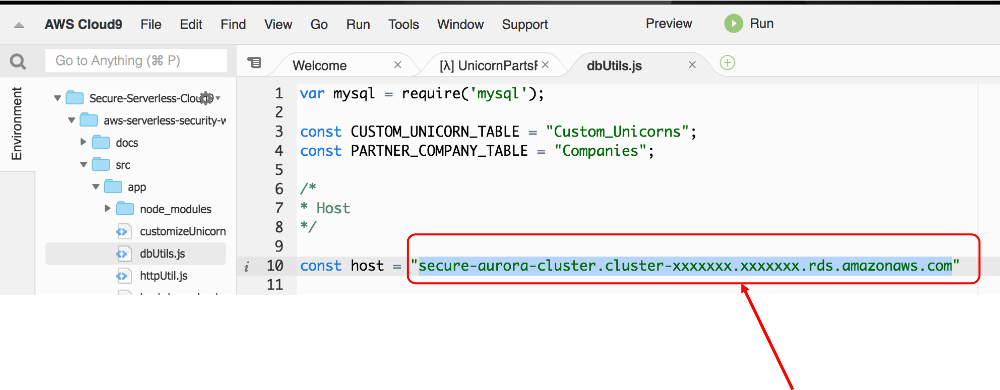

   :bulb: when you have unsaved changes in a file, cloud9 will show a grey dot next to the file name:
   
   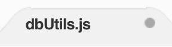
   
   When you successfully save the changes, the dot will turn green and then disappear.

   After doing this, it's time to test your API locally using SAM Local. 

1. On the **right panel**, click on **AWS Resources**. 

	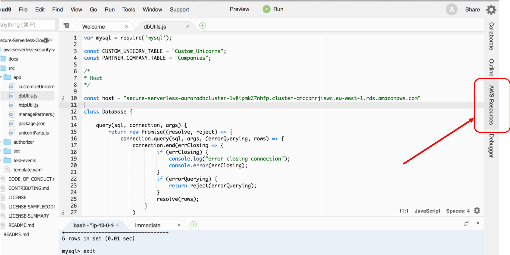

1. You should see a folder tree with the name *Local Functions (1)*. 
1. Select **UnicornPartsFunction** under the `src` folder
1. Once you have selected the function, click on the dropdown on the panel on the top, and select **Run APIGateway Local**  

	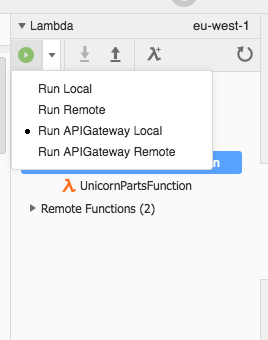

1. Then, click on the play icon. You will get a new panel to test the API locally. 

1. In the **Path** parameter of this new panel, you should see it filled as `/socks`. If not, pick any of the unicorn parts (e.g `/socks`, `/glasses`, `/capes`, `/horns`) and click **Run**.

	> The first time you test the API locally, it could take up to 1-2 minutes to fully initialize due to Docker being setup with a Docker image being pulled down. 

	
	You should be able to get a `200 OK` response with values back for the body part you queried. 
	
	Example screenshot:
	
	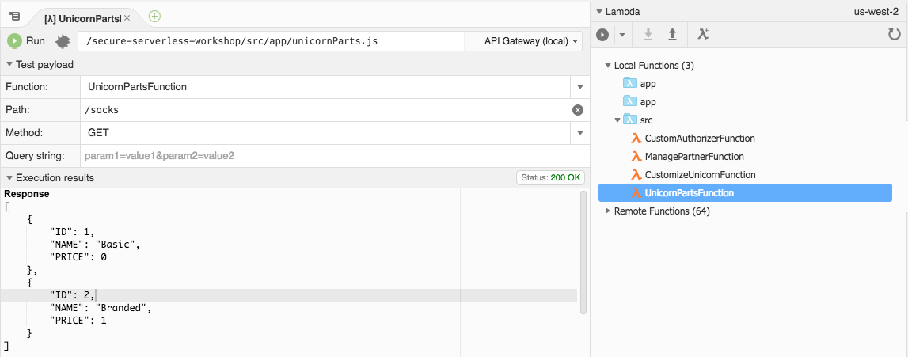
	

	This indicates that the application run successfully within your Cloud9 environment (locally). Now it's time to deploy your Serverless application!

## Module-0F: Deploy and test your Serverless application in the cloud

1. Retrieve the name of the S3 bucket the CloudFormation stack has created earlier:

	* If you copied the CloudFormation output content in the cloud9 scratch pad, find the value of **DeploymentS3Bucket**
	
	  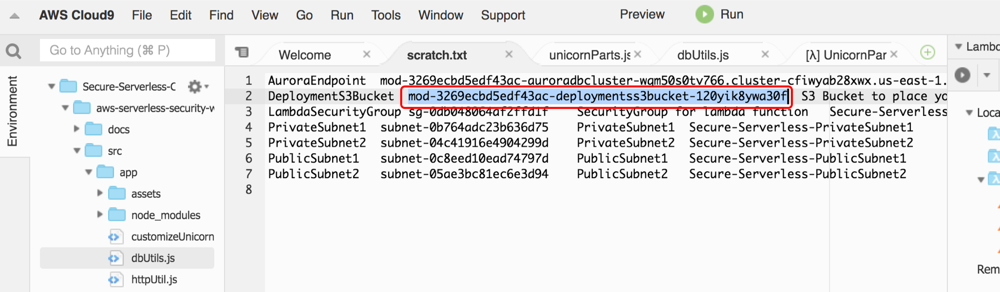
	
	* Otherwise, find the value of **DeploymentS3Bucket** from the Cloudformation console **Output** tab 

	  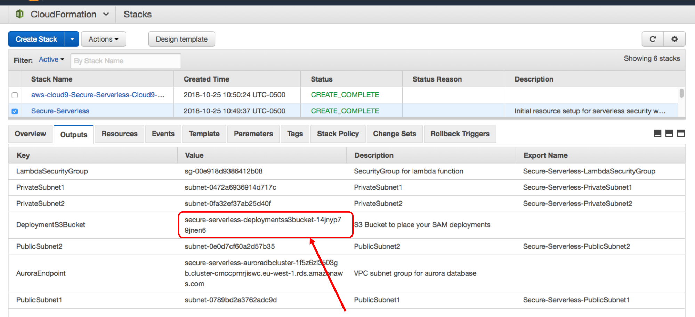

1. In the terminal, set the bash variables:

	```
	REGION=`ec2-metadata -z | awk '{print $2}' | sed 's/[a-z]$//'`
	BUCKET=<use the DeploymentS3Bucket from the CloudFormation output>
	```
	
1. Ensure you are in the `src` folder:

	```
	cd	~/environment/aws-serverless-security-workshop/src
	```

1. Run the following to package up the lambda code and upload it to S3, and update the CloudFormation template to reference the S3 paths that hosts the code:

	```
	aws cloudformation package --template-file template.yaml --s3-bucket $BUCKET --output-template packaged.yaml
	```

1. Deploy the serverless API using the following command. Note that this template references the output from the setup CloudFormation stack (`Secure-Serverless`) for things like subnet IDs. 

	```
	aws cloudformation deploy --template-file packaged.yaml --stack-name CustomizeUnicorns --region $REGION --capabilities CAPABILITY_IAM --parameter-overrides InitResourceStack=Secure-Serverless
	```

1. Wait until you see the stack is successfully deployed:

	```
	Waiting for changeset to be created..
	Waiting for stack create/update to complete
	Successfully created/updated stack - CustomizeUnicorns
	```

1. You can gather the base endpoint of the serverless API we just deployed from the output of the CloudFormation stack. 

	To do it from commandline:

	```
	aws cloudformation describe-stacks --region $REGION --stack-name CustomizeUnicorns --query "Stacks[0].Outputs[0].OutputValue" --output text
	```

	e.g.
```
$ aws cloudformation describe-stacks --region $REGION --stack-name CustomizeUnicorns --query "Stacks[0].Outputs[0].OutputValue" --output text
https://rs86gmk5bf.execute-api.us-west-2.amazonaws.com/dev/
```
	
	Alternatively, you can go to the [CloudFormation Console](https://console.aws.amazon.com/cloudformation/home), find the `CustomizeUnicorns` stack and look in the **Output** tab

1. You can test in your browser (or `curl`) for the following APIs. Remember to append the API path (e.g. `/socks`) to the endpoint

	<table>
	  <tr>
	    <th>API</th>
	    <th>HTTP Verb</th> 
	    <th>path</th> 
	  </tr>
	  <tr>
	    <td>List customization options and prices for horns</td>
	    <td>GET</td> 
	    <td>/horns</td>
	  </tr>
	  <tr>
	    <td> List customization options and prices for glasses </td>
	    <td>GET </td> 
	    <td>/glasses</td>
	  </tr>
	  <tr>
	    <td> List customization options and prices for capes </td>
	    <td>GET</td> 
	    <td>/capes </td>
	  </tr>
	  <tr>
	    <td>List customization options and prices for socks </td>
	    <td> GET </td> 
	    <td>/socks </td>
	  </tr>
	</table>
	
	For example:
	
	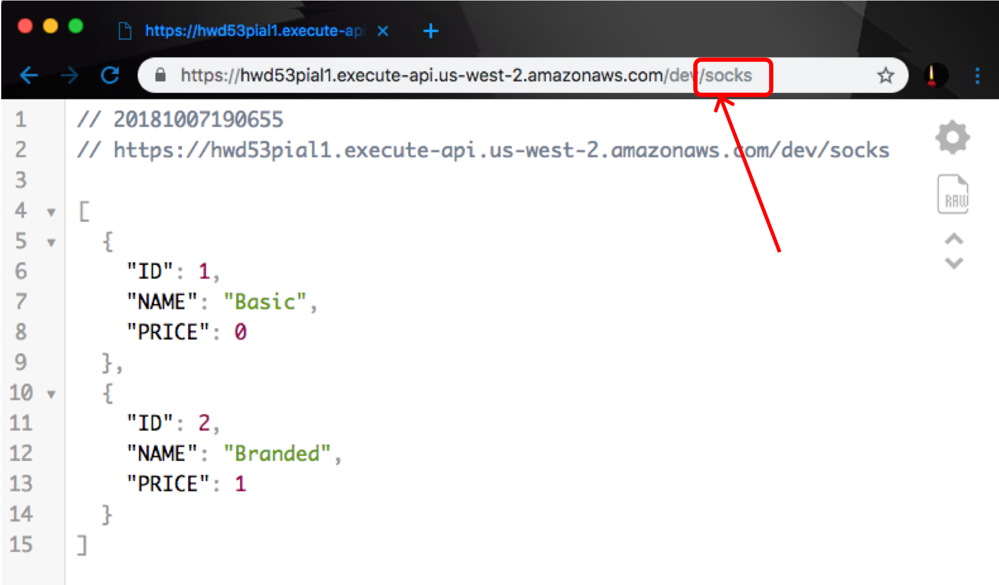

	
## Module-0G: Set up Postman to test the API 


We will use [**Postman**](https://www.getpostman.com/) for the rest of the workshop for testing API requests. 

1. If you don't have installed yet on your laptop, please download it at: [https://www.getpostman.com/](https://www.getpostman.com/)
1. To save you time, we created a Postman collection that you can use to test each of the APIs we are working with today. 

	* click on the **Import** button in postman
	* Then use **Import from Link** and supply the below link:

		`https://raw.githubusercontent.com/aws-samples/aws-serverless-security-workshop/master/src/test-events/Customize_Unicorns.postman_collection.json`
	* Click on **Import**
	
		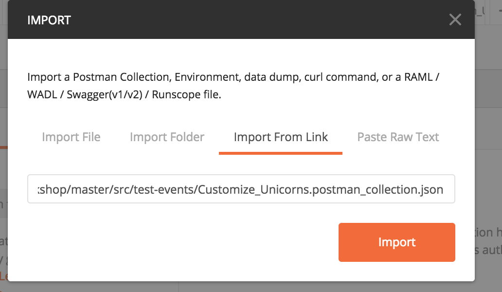
	
1. You should now see a collection called `Customize_Unicorns` imported in postman on the left hand side

	


1. We need to set the `base_url` variable by creating a environment in postman.
	1. Click the &#9881; icon (“Manage Environments”) in the upper right corner of the Postman app.

	   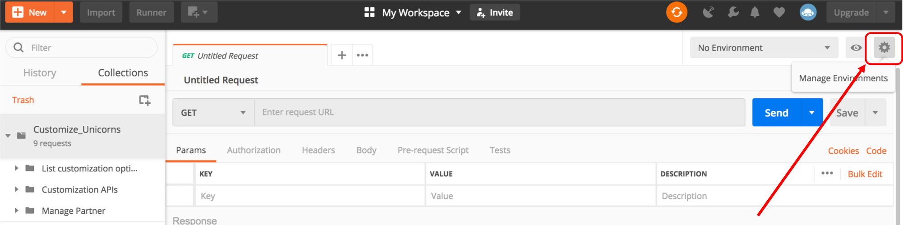

	
	1. Create a new environment by clicking the **Add** button.
	1. Enter an environment name, e.g. `dev`
	1. Add an variable `base_url` and use the base API endpoint we deployed earlier.	

	   &#9888; **Ensure to leave out the trailing `/`!**  &#9888;

	   See example screenshot below 

	   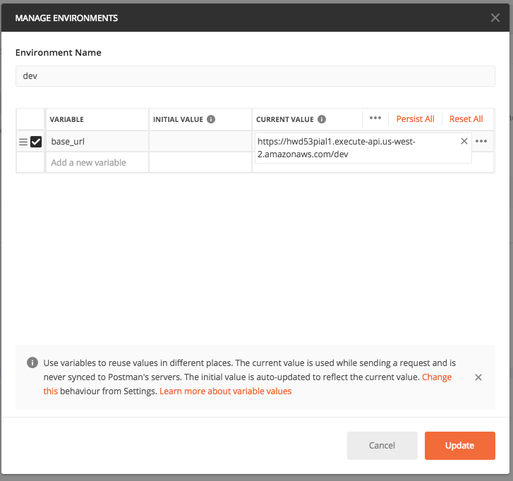
	
	> See documentation from Postman on [managing environments](https://www.getpostman.com/docs/v6/postman/environments_and_globals/manage_environments) if you want to learn more.
1. Click **Add** to create the `dev` environment and exit out the Manage Environments by clicking the **X**
1. Select `dev` on the environment drop down menu. 

	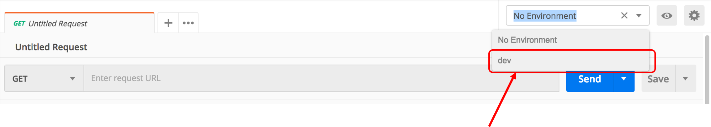


1. Now, you are ready to test the API using postman. In the left sidebar, click on the `Customize_Unicorns` collection, expand the `List customization options` folder. Select an API in the folder and test sending an request by clicking on the **Send** button

	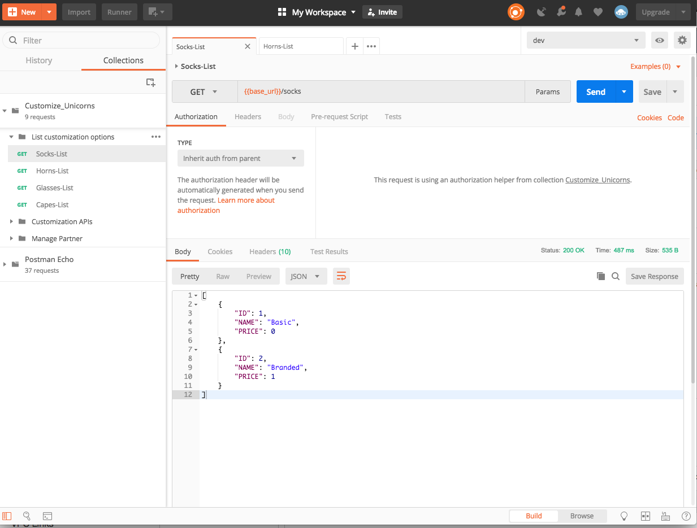


## Next step
To start securing the serverless application you just deployed, return to the workshop [landing page](../../README.md) to pick a module to work on! 

