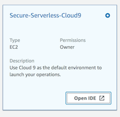
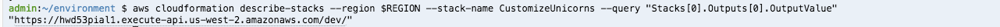

# Module 0: Initial Setup

In this set up module, you will deploy a simple serverless application, which you will learn to secure in the following modules. You will create an REST API endpoint so partner companies of Wild Rydes can submit unicorn customizations such as branded socks and capes to advertise their company. Below is a high level architecture of what you will be deploying: 


## Module-0A: Create a VPC and Cloud9 environment required for this workshop

A VPC is required for our workshop so we can:

* Leverage a Cloud9 environment as our IDE (integrated development environment)
* Use an RDS Aurora MySQL database as the backend database for our serverless application. 

Follow the steps below to create the set up resources (VPC, Cloud9 environment, etc.)

1. Select the desired region. Since we are going to use services like Aurora or Cloud9, please choose one of these following and Click the corresponding **Launch Stack** link

	Region| Code | Launch
	------|------|-------
	EU (Ireland) | <span style="font-family:'Courier';">eu-west-1</span> | [](https://console.aws.amazon.com/cloudformation/home?region=eu-west-1#/stacks/new?stackName=Secure-Serverless&templateURL=https://s3.amazonaws.com/wildrydes-us-east-1/Security/init-template.yml)
	US East (Ohio) | <span style="font-family:'Courier';">us-east-2</span> | [](https://console.aws.amazon.com/cloudformation/home?region=us-east-2#/stacks/new?stackName=Secure-Serverless&templateURL=https://s3.amazonaws.com/wildrydes-us-east-1/Security/init-template.yml)
	US West (Oregon) | <span style="font-family:'Courier';">us-west-2</span> | [](https://console.aws.amazon.com/cloudformation/home?region=us-west-2#/stacks/new?stackName=Secure-Serverless&templateURL=https://s3.amazonaws.com/wildrydes-us-east-1/Security/init-template.yml)
	US East (N. Virginia) | <span style="font-family:'Courier';">us-east-1</span> | [](https://console.aws.amazon.com/cloudformation/home?region=us-east-1#/stacks/new?stackName=Secure-Serverless&templateURL=https://s3.amazonaws.com/wildrydes-us-east-1/Security/init-template.yml)

1. In the **Specify Details** page:
	* name you stack ***`Secure-Serverless`***
	* for the database password, use ***`Corp123!`***
	and click **Next**
1. in the **Options** page, accept the default configurations and click **Next**
1. Review the configuration and click **Create**
1. While you are waiting for the completion of the CloudFormation stack creation, check if you have **PostMan** installed on your laptop. If not, download and install it at: [https://www.getpostman.com](https://www.getpostman.com), we will need to use it later. 

1. Once the CloudFormation creation completes, go to the Outputs tab and copy the **AuroraEndpoint**. You will need it to connect to the Aurora database in the next step: 

	

This CloudFormation stack spins up the below resources:

* A **VPC** with 4 subnets, 2 private and 2 public. 
* A **Cloud9** environment where you will be developing and launching the rest of the workshop resources from.
* A **MySQL Aurora RDS database** (the primary DB instance may reside in either of the 2 private subnets)


In addition, it also creates the below resources

* A **S3 bucket** you will later use for packaging and uploading lambda function code 
* A **Security Group** that will be used by the lambda functions


## Module-0B: Prepare your database

We need to create some tables and insert some initial values to the Aurora database. We launched the Aurora database in private subnet following security best practices so the database is not reachable directly from the Internet. 

Because your Cloud9 instance and the Aurora database is in the same VPC, you can administer the database from the Cloud9 instance (The security group of the database the have been configured to allow the traffic):


First go to your **Cloud9** Environment.

1. Go to the Cloud9 console and click on ***Your environments***
1. Under the *Secure-Serverless-Cloud9* environment, click on ***Open IDE***
	
	

1. We need to get the content of this workshop in this environment so clone this repository using the terminal:

	`git clone https://github.com/aws-samples/aws-serverless-security-workshop.git`

1. Go into the folder of the repo using `cd aws-serverless-security-workhop/`

It's time to initiate your database. 

1. Connect to your cluster with the following command. Replace the endpoint with the one you copied before (don't lose it yet, you still need it later).

	`mysql -h <YOUR-AURORA-SERVERLESS-ENDPOINT> -u admin -p`

	You should be prompted with a password. Use *`Corp123!`* (the one you specified before).

1. Within the mysql command prompt (`mysql> `), enter the following command: 

	`source src/init/db/queries.sql`
	
	You should see an output such as this:
	
	``` bash
	mysql> source src/init/db/queries.sql
	Query OK, 1 row affected (0.01 sec)
	
	Database changed
	Query OK, 0 rows affected (0.02 sec)
	
	Query OK, 0 rows affected (0.02 sec)
	
	Query OK, 0 rows affected (0.02 sec)
	
	Query OK, 0 rows affected (0.02 sec)
	
	Query OK, 0 rows affected (0.02 sec)
	
	Query OK, 0 rows affected (0.03 sec)
	
	Query OK, 1 row affected, 1 warning (0.00 sec)
	
	Query OK, 2 rows affected (0.01 sec)
	Records: 2  Duplicates: 0  Warnings: 0
	
	Query OK, 8 rows affected (0.01 sec)
	Records: 8  Duplicates: 0  Warnings: 0
	
	Query OK, 7 rows affected (0.00 sec)
	Records: 7  Duplicates: 0  Warnings: 0
	
	Query OK, 4 rows affected (0.00 sec)
	Records: 4  Duplicates: 0  Warnings: 0
		
	mysql> 
	```

1. You can explore the database tables created by running the following SQL query:
	
	```sql 
	SHOW tables;
	```

	You should see something like this

	```sql 
	mysql> SHOW tables;
	+---------------------------------+
	| Tables_in_unicorn_customization |
	+---------------------------------+
	| Capes                           |
	| Companies                       |
	| Custom_Unicorns                 |
	| Glasses                         |
	| Horns                           |
	| Socks                           |
	+---------------------------------+
	6 rows in set (0.00 sec)
	```

	Explore the content of the tables using 
	
	```sql 
	SELECT * FROM Capes;
	```

	You should see something like this
	
	```sql
	mysql> SELECT * FROM Capes;
	+----+--------------------+-------+
	| ID | NAME               | PRICE |
	+----+--------------------+-------+
	|  1 | White              |  0.00 |
	|  2 | Rainbow            |  2.00 |
	|  3 | Branded on White   |  3.00 |
	|  4 | Branded on Rainbow |  4.00 |
	+----+--------------------+-------+
	4 rows in set (0.00 sec)
	```

1. After that, you can use the command `exit` to drop the mysql connection.

## Module-0C: Review the starting code for the serverless application

The code for the lambda functions resides within the path `src/app`. The first thing you need to do is install node dependencies by navigating to this folder and using the following command: 
	
`cd src/app && npm install`
	
This folder has a few files. Review the content of the below files: 
	
- **unicornParts.js**: Main file for the lambda function that lists unicorn customization options.  
- **customizeUnicorn.js**: Main file for the lambda function that handles the create/describe/delete operations for a unicorn customization configuration.
- **dbUtils.js**: This file contains all the database/query logic of the application. It also contains all the connection requirements in plain text (that's suspicious!)
- **httpUtils.js**: This file contains the http response logic from your application.

In addition, these additional files reside in the folder. No need to review them closely at this point:

- **managePartners.js**: Main file for the lambda function that handles the logic to register a new partner company. We will go into details on this one in Module 1. 
- **package.json**: Nodejs project manifest, including listing dependencies of the code 

In addition to the lambda code, the configurations for Lambda function and the REST APIs are spelled out in `template.yaml` as a **AWS SAM** (Serverless Application Model) template. 

[AWS SAM](https://github.com/awslabs/serverless-application-model) allows you to define serverless applications in simple and clean syntax. In the `template.yaml`, you can see we have defined 3 lambda functions, and it maps to a set of REST APIs defined in a Swagger template: 

<table>
  <tr>
    <th>Lambda Function</th>
    <th>Main handler code</th>
    <th>API resource</th>
    <th>HTTP Verb</th>
    <th>Description</th>
  </tr>
  <tr>
    <td rowspan="4">UnicornPartsFunction</td>
    <td rowspan="4">unicornParts.js</td>
    <td>/horns</td>
    <td>GET</td>
    <td>List customization options for horns</td>
  </tr>
  <tr>
    <td>/glasses</td>
    <td>GET</td>
    <td>List customization options for glasses</td>
  </tr>
  <tr>
    <td>/socks</td>
    <td>GET</td>
    <td>List customization options for socks</td>
  </tr>
  <tr>
    <td>/capes</td>
    <td>GET</td>
    <td>List customization options for capes</td>
  </tr>
  <tr>
    <td rowspan="4">CustomizeUnicornFunction</td>
    <td rowspan="4">customizeUnicorn.js</td>
    <td>/customizations</td>
    <td>POST</td>
    <td>Create unicorn customization</td>
  </tr>
  <tr>
    <td>/customizations</td>
    <td>GET</td>
    <td>List unicorn customization</td>
  </tr>
  <tr>
    <td>/customizations/{id}</td>
    <td>GET</td>
    <td>Describe a unicorn customization</td>
  </tr>
  <tr>
    <td>/customizations/{id}</td>
    <td>DELETE</td>
    <td>Delete a unicorn customization</td>
  </tr>
  <tr>
    <td>ManagePartnerFunction</td>
    <td>managePartners.js</td>
    <td>/partners</td>
    <td>POST</td>
    <td>Register a new partner company</td>
  </tr>
</table>

## Module-0D: Run your serverless application locally with SAM Local

After reviewing the code, under **dbUtils.js**, replace the *host* with the Aurora endpoint. 


After doing this, it's time to test your API locally using SAM Local. 

1. On the **right panel**, click on **AWS Resources**. 
1. You should see a folder tree with the name *Local Functions (1)*. 
1. Select **UnicornPartsFunction** under the `src` folder
1. Once you have selected, above the tree, top of the panel, you should see a play button.With a Drop down. Within that dropdown, select **Run APIGateway Local**  

	

1. Then, click on the play icon. You will get a new panel to test the API locally. 
1. In the **Path** parameter of this new panel, you should see it filled as `/socks`. If not, pick any of the unicorn parts (e.g `/socks`, `/glasses`, `/capes`, `/horns`) and click **Run**.

	
You should be able to get a result similar to this:
	

	

This indicates that the application run successfully within your Cloud9 environment (locally). Now it's time to deploy your Serverless application!

## Module-0E: Deploy and test your Serverless application in the cloud


1. Go to [CloudFormation console](https://console.aws.amazon.com/cloudformation/home).
1. Select `Secure-Serverless` stack.
1. In the Output Module, take note of **DeploymentS3Bucket**

	


1. In the terminal, set the bash variables:

	```
	REGION=<fill in the region you used to deploy the initial setup resrouces>
	BUCKET=<use the DeploymentS3Bucket from the CloudFormation output>
	```
	
1. Ensure you are in the `src` folder:

	```
	cd	~/environment/aws-serverless-security-workshop/src
	```

1. Run the following to package up the lambda code and upload it to S3, and update the CloudFormation template to reference the S3 paths that hosts the code:

	```
	aws cloudformation package --template-file template.yaml --s3-bucket $BUCKET --output-template packaged.yaml
	```

1. Deploy the serverless API using the following command. Note that this template references the output from the setup CloudFormation stack (`Secure-Serverless`) for things like subnet IDs. 

	```
	aws cloudformation deploy --template-file packaged.yaml --stack-name CustomizeUnicorns --region $REGION --capabilities CAPABILITY_IAM --parameter-overrides InitResourceStack=Secure-Serverless
	```

1. Wait until you see the stack is successfully deployed:

	```
	Waiting for changeset to be created..
	Waiting for stack create/update to complete
	Successfully created/updated stack - CustomizeUnicorns
	```

1. You can gather the base endpoint of the serverless API we just deployed from the output of the CloudFormation stack. 

	To do it from commandline:

	```
	aws cloudformation describe-stacks --region $REGION --stack-name CustomizeUnicorns --query "Stacks[0].Outputs[0].OutputValue"
	```

	e.g.
	
	
	Alternatively, you can go to the CloudFormation Console, find the `CustomizeUnicorns` stack and look in the Output Module

1. You can test in your browser (or `curl`) for the following APIs. Remember to append the API path (e.g. `/socks`) to the endpoint

	<table>
	  <tr>
	    <th>API</th>
	    <th>HTTP Verb</th> 
	    <th>path</th> 
	  </tr>
	  <tr>
	    <td>List customization options and prices for horns</td>
	    <td>GET</td> 
	    <td>/horns</td>
	  </tr>
	  <tr>
	    <td> List customization options and prices for glasses </td>
	    <td>GET </td> 
	    <td>/glasses</td>
	  </tr>
	  <tr>
	    <td> List customization options and prices for capes </td>
	    <td>GET</td> 
	    <td>/capes </td>
	  </tr>
	  <tr>
	    <td>List customization options and prices for socks </td>
	    <td> GET </td> 
	    <td>/socks </td>
	  </tr>
	</table>
	
	For example:
	
	

	
## Module-0F: Set up Postman to test the API 


We will use [**Postman**](https://www.getpostman.com/) for the rest of the workshop for testing API requests. 

1. If you don't have installed yet on your laptop, please download it at: [https://www.getpostman.com/](https://www.getpostman.com/)
1. To save you time, we created a Postman collection that you can use to test each of the APIs we are working with today. 

	* click on the **Import** button in postman
	* Then use **Import from Link** and supply the below link:

		`https://raw.githubusercontent.com/aws-samples/aws-serverless-security-workshop/master/src/test-events/Customize_Unicorns.postman_collection.json`
	* Click on **Import**
	
		
	
1. You should now see a collection called `Customize_Unicorns` imported in postman
1. We need to set the `base_url` variable by creating a environment in postman. See documentation from Postman on [managing environments](https://www.getpostman.com/docs/v6/postman/environments_and_globals/manage_environments) if you want to learn more:
	1. Click the “Manage Environments” icon in the upper right corner of the Postman app.
	1. Create a new environment by clicking the **Add** button.
	1. Enter an environment name, e.g. `dev`
	1. Add an variable `base_url` and use the base API endpoint we deployed earlier (ensure the leave out the trailing `/`). See example screenshot below 
	
		
1. Select `dev` on the environment drop down menu. 
1. Now, you are ready to test the API using postman. Select an API in the  `Customize_Unicorns` and test sending an request

	


## Next step
To start securing the serverless application you just deployed, click below to go to module 1:  

<a href="../01-add-authentication/"></a>

