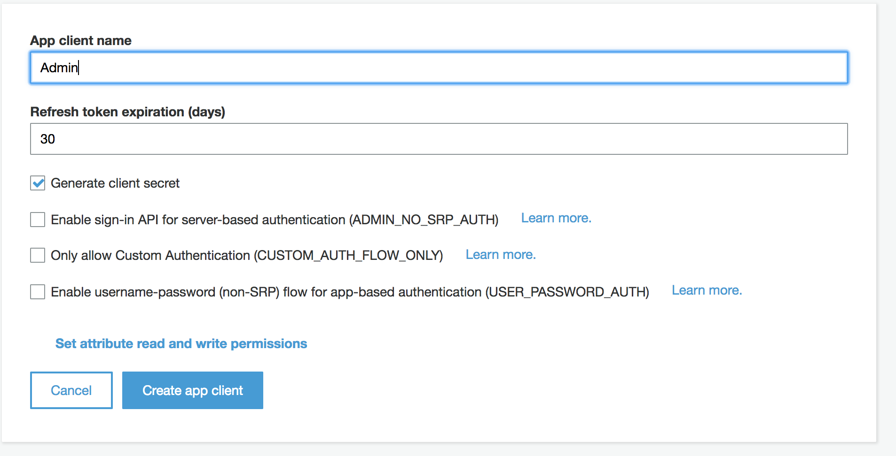
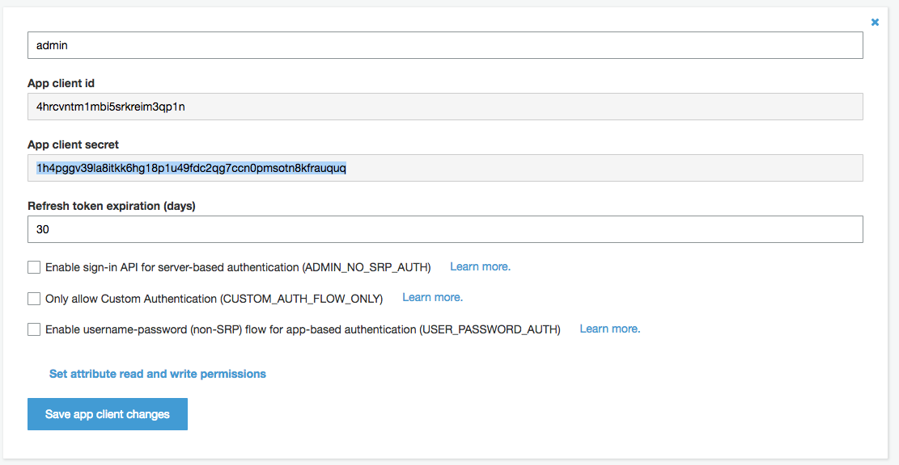
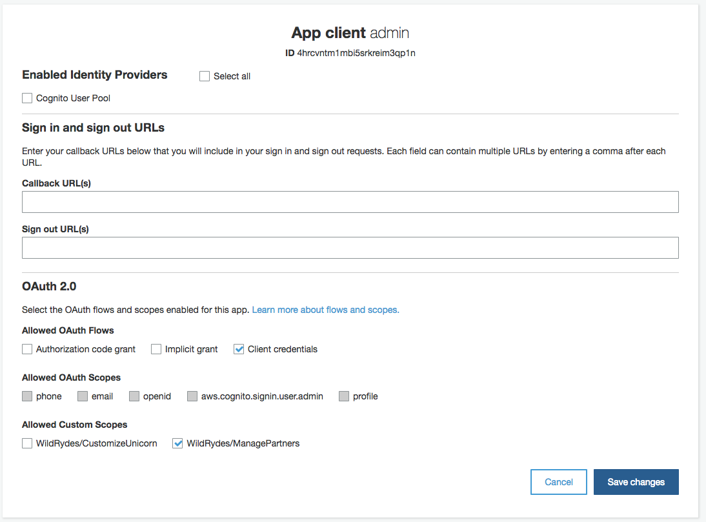
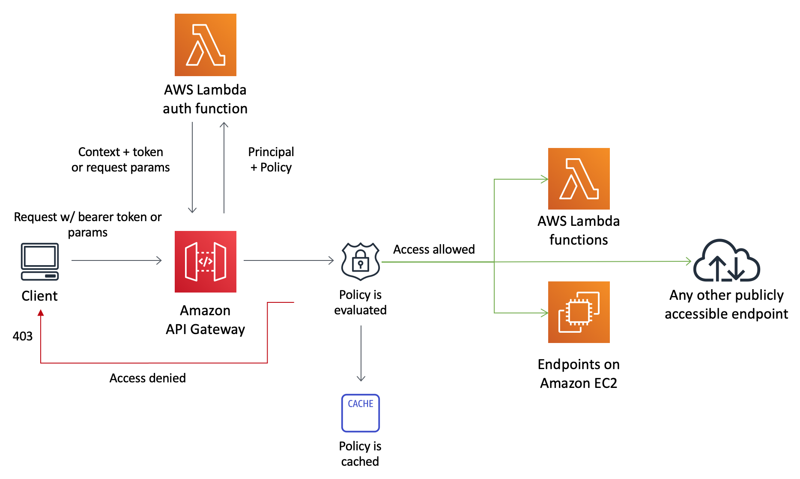

# Module 1: Add Authentication and Authorization

As you have probably noticed, the serverless app we just deployed is now to anyone in the world to access. Attackers can submit any number of unicorn customizations and we have no way of knowing who really made the request. 

To lock down access to the API to only trusted partners, we must add authentication and authorization to the API. 

Given that our use case is for 3rd party companies to programmatically access the API, there are a few options we can take to implement auth: 

* Use **API Keys** - this is the simplest option, but it doesn't provide lots of flexibility. For example, it requires us to build our own authorization system if fine-grained access control is needed (e.g. different clients may require different access to different APIs). 
* Use **OAuth** [**Client Credentials Flow**](https://tools.ietf.org/html/rfc6749#section-4.4) This is a well-defined standard where the client authenticates with an authorization server (in our example, Amazon Cognito) using client credentials, get a access token, then calls the API Gateway with the access token. 

	
	
We chose to use the Oauth Client Credentials option for the workshop today, because compared to using API keys, using the client credentials flow allow us to:

* Easily define different authorization [**scopes**](https://www.oauth.com/oauth2-servers/scope/) so different kinds of clients may have access to different APIs and resources
* In the future, we may have use cases where the API will be accessed through a web UI managed by Wild Rydes instead of programmatic access. Or we may want to allow 3rd party companies to build custom apps that makes requests on behalf of riders/unicorns (see [example walkthrough](https://github.com/aws-samples/aws-serverless-workshops/tree/master/WebApplication/5_OAuth) for that use case). Designing our APIs to authenticate with Oauth access tokens give us flexibility to support these options down the line.  

In this module, you will use **Amazon Cognito** to act as the **Authorization server**, and leverage [**Lambda authorizer**](https://docs.aws.amazon.com/apigateway/latest/developerguide/apigateway-use-lambda-authorizer.html) for API Gateway to inspect the token and determine the access policies based on the token. By the end of the module, your architecture will look like this: 


> Once you decide to do this module, you won't be able to use Cloud9 Local testing as we haven't configured the correct permissions to test locally this functionality.

## Module 1 instructions

Quick links to submodules:

* [**Module 1A**](#1A): Configure Cognito User Pool with a hosted domain
* [**Module 1B**](#1B): Create the authorization scopes in the Cognito User Pool
* [**Module 1C**](#1C): Create client credentials for internal admin account 
* [**Module 1D**](#1D): Deploy Custom Authorizer lambda
* [**Module 1E**](#1E): Use the admin client to register new partner companies
* [**Module 1F**](#1F): Use the partner company client credentials to customize unicorns


### <a name="1A"></a>Module 1A: Create a Cognito User Pool and hosted domain

**[Amazon Cognito](https://aws.amazon.com/cognito)** provides a managed service for simplifying identity management for your apps. In order to 

1. As a preparation for this module, we have already provisioned a Cognito User Pool. Review it under the **Resources** section of `template.yaml`:

	```
	  CognitoUserPool:
	    Type: "AWS::Cognito::UserPool"
	    Properties:
	      UserPoolName: !Sub '${AWS::StackName}-users'
	```

1. To configure the Cognito User Pool with a domain, go to the [Cognito management console](https://console.aws.amazon.com/cognito/home), and click on **Manage User Pools**

1. Click on the user pool created by the SAM Template (`template.yaml`). It should be named "**CustomizeUnicorns-users**"

1. Under **App Integration**, go to the **Domain Name** tab to set up an unique Cognito domain our API consumers will use for authentication requests.

	**You must pick a unique custom domain name**! For example `custom-unicorn-johndoe`
	
1. Make sure that the domain name is available and then click **Save changes**

	

1. Note down the domain name (In the format of `https://<your-custom-name>.auth.<aws-region>.amazoncognito.com`), you will need this later. 

	**Tip 1**: You can copy the full domain name by going to the **App Integration** tab. 
	
	**Tip 2**: You can copy the full domain name into a text editor on your laptop or create a new file in the cloud9 IDE environment to use as scratch pad for storing such values. 


### <a name="1B"></a>Module 1B: Create the authorization scopes in the Cognito User Pool

Amazon Cognito User Pools lets you declare custom resource servers. Custom resource servers have a unique identifier - normally the server uri - and can declare custom <a href="https://www.oauth.com/oauth2-servers/scope/" target="blank"> **scopes** </a>. Scopes allow you to limit the access of an app to a smaller subset of all the available APIs and resources. 

For this app, we will start with defining 2 scopes:

* **CustomizeUnicorn** - used by 3rd party partners that allows listing unicorn outfit customization options and create/describe/delete unicorn customizations. 
* **ManagePartners** - used by internal apps/admin to register partner companies

To achieve this: 

1. Go to the **Resource Servers** tab under **App integration**

1. In the resource servers screen, click **Add a resource server**.

1. Specify `WildRydes` as the Name.

1. Use `WildRydes` as the Identifier for the custom resource server.

1. In the Scopes section, declare 2 new scopes:
	* `CustomizeUnicorn` - used by 3rd party partners to customize unicorns
	* `ManagePartners` - used by internal apps/admin to register partner companies
	
	then click **Save changes** 
	
	

### <a name="1C"></a> Module 1C: Create client credentials for internal admin account

Each new company that signs up to customize unicorns will need to be provisioned a set of client credentials (client ID and client secret) they can use with their request. This means we would need a process to create and distribute these client credentials.  

In real life, you would probably want to do this in a web developer portal. The partner companies sign in with some user name and password to the web portal, then they can request a set of client credentials to use to make programmatic requests with. However, due to limited time for the workshop, we will just simplify this by having a **POST /partner** API that you as the admin working for Wild Rydes can use to sign up partner companies. 

So now, let's get you a set of admin credentials with the `WildRydes/ManagePartners` OAuth scope, so you can start signing up other companies! 


1. In the Cognito console, go to the **App Clients** tab under **General Settings**

1. Click **Add an app client**

1. Use `Admin` for app client name

	

1. Click **Create app client**

1. This generates a **App client id** and **App client secret** for the admin app client. Click on **Show Details** to see both values, copy them down for later use.

	


1. Go to **App client settings** tab under **App integration**

1. For the Admin client we just crated, enable the **Client credentials** Oauth Flow and select the Custom Scopes for **WildRydes/ManagePartners**, and click **Save changes**

	
	


### <a name="1D"></a> Module 1D: Deploy Custom Authorizer lambda
We need to configure a [**Lambda authorizer**](https://docs.aws.amazon.com/apigateway/latest/developerguide/apigateway-use-lambda-authorizer.html) for API Gateway. As you can see in the below diagram, a lambda function is needed to inspect the access token in the request, and determine the identity and the corresponding access policy of the caller. 



1. Switch back to the browser tab with your Cloud9 IDE environment or reopen it from the [Cloud9 console](https://console.aws.amazon.com/cloud9/home)

1. In the serverless API we have deployed, the backend logic has an identifier for 3rd party companies (The primary key of the `Companies` MySQL table and a foreign key constraint for the `Custom_Unicorns` table.) When the lambda function inspect the access token, it can parse out the OAuth ClientID from it. To be able to tell the backend lambda which company is making the request, we need a lookup table that maps the ClientID to the company IDs in the backend database. In this case, we chose to use a separate DynamoDB table to store this mapping to separate the auth functionality from the backend system:
 
	

1. As a preparation for this module, we have also already provisioned a DynamoDB table to store this mapping. Review it under the **Resources** section of `template.yaml`:

	```
	  PartnerDDBTable:
	    Type: AWS::Serverless::SimpleTable
	    Properties:
	      PrimaryKey:
	        Name: ClientID
	        Type: String
	      TableName: !Sub '${AWS::StackName}-WildRydePartners'
	
	```

1. Next, we need the code for lambda authorizer! Review the code in the `src/authorizer` folder. 

	Here's a high level summary of what the authorizer logic contains:
	
	* Download the public key from the Cognito user pool, if not already cached
	* Decode the JWT token and validate the signature with the public key 
	* Based on the claims parsed from the JWT token, generate a response policy that specifies API resources and actions the caller is permitted to access
	

1. Install nodejs dependencies in the `src/authorizer` folder:

	```
	cd ~/environment/aws-serverless-security-workshop/src/authorizer
	npm install
	```

1. Add the authorizer lambda to the **Resources** section of `template.yaml`:

	```
	  CustomAuthorizerFunction:
	    Type: AWS::Serverless::Function
	    Properties:
	      CodeUri: authorizer/
	      Runtime: nodejs8.10
	      Handler: index.handler
	      Policies:
	        Statement:
	          - Effect: Allow
	            Action:
	            - "dynamodb:*"
	            Resource: "*"
	      Environment:
	        Variables:
	          USER_POOL_ID: !Ref CognitoUserPool
	          PARTNER_DDB_TABLE: !Ref PartnerDDBTable
	```


1. API gateway require an IAM role to invoke the custom authorizer. Add it to the SAM template as another **Resource** object: 

	```
	  ApiGatewayAuthorizerRole:
	    Type: AWS::IAM::Role
	    Properties:
	      AssumeRolePolicyDocument:
	        Version: "2012-10-17"
	        Statement:
	          -
	            Effect: "Allow"
	            Principal:
	              Service:
	                - "apigateway.amazonaws.com"
	            Action:
	              - sts:AssumeRole
	      Policies:
	        -
	          PolicyName: "InvokeAuthorizerFunction"
	          PolicyDocument:
	            Version: "2012-10-17"
	            Statement:
	              -
	                Effect: "Allow"
	                Action:
	                  - lambda:InvokeAsync
	                  - lambda:InvokeFunction
	                Resource:
	                  Fn::Sub: ${CustomAuthorizerFunction.Arn}
	```

1. Find the swagger definition of the API gateway in the SAM template 

	```
	  UnicornApi:
	    Type: AWS::Serverless::Api
	    Properties:
	      StageName: dev
	      DefinitionBody:
	        swagger: "2.0"
	        info:
	          title:
	            Ref: AWS::StackName
	          description: My API that uses custom authorizer
	          version: 1.0.0
	        ### TODO: add authorizer
	        paths:
			   ....
	```

1. Replace the `### TODO: add authorizer` section with

	```
	        securityDefinitions:
	          CustomAuthorizer:
	            type: apiKey
	            name: Authorization
	            in: header
	            x-amazon-apigateway-authtype: custom
	            x-amazon-apigateway-authorizer:
	              type: token
	              authorizerUri:
	                Fn::Sub: arn:aws:apigateway:${AWS::Region}:lambda:path/2015-03-31/functions/${CustomAuthorizerFunction.Arn}/invocations
	              authorizerCredentials:
	                Fn::Sub: ${ApiGatewayAuthorizerRole.Arn}
	              authorizerResultTtlInSeconds: 60

	```
	
	**Caution:** Ensure the `securityDefinitions` section you pasted is at the same indentation level as `info` and `paths`

1. In the `paths` section of the Swagger template, uncomment the 

	```
	#              security:
	#                - CustomAuthorizer: []
	```

	lines for each API method. For example: 

	Change 
	
	```
	          "/socks":
	            get:
	#              security:
	#                - CustomAuthorizer: []
	              x-amazon-apigateway-integration:
	                httpMethod: POST
	                type: aws_proxy
	                uri:
	                  Fn::Sub: arn:aws:apigateway:${AWS::Region}:lambda:path/2015-03-31/functions/${UnicornPartsFunction.Arn}/invocations
	              responses: {}
				...
	```
	
	Into:
	
	```
	        paths:
	          "/socks":
	            get:
	              security:
	                - CustomAuthorizer: []
	              x-amazon-apigateway-integration:
	                httpMethod: POST
	                type: aws_proxy
	                uri:
	                  Fn::Sub: arn:aws:apigateway:${AWS::Region}:lambda:path/2015-03-31/functions/${UnicornPartsFunction.Arn}/invocations
	              responses: {}
				...
	```
1. Save the `template.yaml` file
1. Now we need to validate the template.

	First, ensure we are back in the `src` folder in the terminal
	
	```
	cd ..
	
	```
	
	Then run 
	

	```
	sam validate -t template.yaml
	```
	
	If the SAM template has no errors, you should see 
	
	```
	2018-10-08 16:00:56 Starting new HTTPS connection (1): iam.amazonaws.com
	<your directory>/src/template.yaml is a valid SAM Template
	```
	
	otherwise, fix the syntax error before continuing to next step

1.  Deploy the updates by running the same commands we used in module 0 to deploy the application:

	```
	 aws cloudformation package --output-template-file packaged.yaml --template-file template.yaml --s3-bucket $BUCKET --s3-prefix securityworkshop --region $REGION &&  aws cloudformation deploy --template-file packaged.yaml --stack-name CustomizeUnicorns --region $REGION --capabilities CAPABILITY_IAM --parameter-overrides InitResourceStack=Secure-Serverless
	```

1. After the SAM template has finished updating, go to the [API Gateway console](https://console.aws.amazon.com/apigateway) and click into the API we just updated. Under **Resources**, choose any method in the API, and you should see **Auth: CustomAuthorizer** under **Method Request**:

	

1. Now go back to Postman and test sending API requests (any API in the collection). You should now get **401 Unauthorized** errors from the APIs now.

	> Make sure you didn't miss any APIs! 


### <a name="1E"></a>Module 1E: Use the admin client to register new partner companies

Now we have configured our API so only authenticated requests can get through to our protected resources. Our next step is getting some credentials to make authenticated requests with! 

To make authenticated requests using the admin client credentials we just created in Module 1C, we can use PostMan:

1. In Postman, right click on the **Manage Partner** folder and click **edit**
1. In the Edit Folder window that pops up, go to **Authorization** tab, and change the Auth **Type** to `OAuth 2.0`, then click **Get New Access Token** 

	

1. Configure the token request:
	
	* **Name**: `admin`
	
	* **Grant Type**: `Client Credentials`
	* **Access Token URL**: Remember the cognito domain we created in [module 1A](#1A)? use that and append `/oauth2/token` to the end

		> The full URL should look like `https://custom-unicorn-johndoe.auth.us-west-2.amazoncognito.com/oauth2/token`
	
	* **Client ID**: this the clientID of the admin we created in Module 1D
	* **Client Secret**:  this the client secret of the admin we created in Module 1D
	* **Scope**: it's optional (the token will be scoped anyways) we can leave it blank
		
	

	And click **Request Token**

1. Now you should see the new token returned from Cognito. scroll down and click **Use Token**

1. Back to the Edit Folder window, click **update**

1. Now, go to the **POST Create Partner** API in the **Manage Partner** Folder in the left hand toolbar

1. In the **Body** tab, fill in the name of the partner company to register, and click **Send**. You should get in the response the client ID and secret for the company you registered. 

	
	
1. Note down the `ClientId` and `ClientSecret` from the output in your text editor. This is the client credentials "Cherry Corp" will use to customize unicorns! 

### <a name="1F"></a>Module 1F: Use the partner company client credentials to customize unicorns

Now we have a set of client credentials for the partner company you just registered. Let's pretend to be "Cherry company" (or whatever company you just registered) and submit some unicorn customizations!


1. Request an access token from the new company client credentials you just generated. (You will notice this is very similar steps as you did in [module 1E](#1E)!

	1. Right click on the **Customize_Unicorns** collection and **edit**

		> Ensure to right click on the overarching **Customize_Unicorns** collection rather than any of the subfolders. Doing so will set the default authorization header to use for any API in the collection, unless overridden by the sub-folders (as we just did in module 1E)
		
	1. Go to **Authorization** tab, pick Oauth2.0
	1. Use the same Cognito token url (hint: Cognito domain + `/oauth2/token`)
	1. Use the Client ID generated from the **POST /partner** API you just created from step [module 1E](#1E)

		> Tip: if you forget the client ID/secret, you can also retrieve it from the Cognito User pool console under **App clients**
	
		

1. Test making a request for describing sock customziation options again. It should succeed this time!

1. Now you can create a unicorn customziation! Choose the **POST create Custom_Unicorn** API from the collection, in the **Body** tab, enter 

	```javascript
	{  
	   "name":"Cherry-themed unicorn",
	   "imageUrl":"https://en.wikipedia.org/wiki/Cherry#/media/File:Cherry_Stella444.jpg",
	   "sock":"1",
	   "horn":"2",
	   "glasses":"3",
	   "cape":"4"
	}
	```
	
	If it's succussful, you should get a response with the ID of the customization that was just submitted: 
	
	`{ "customUnicornId": X}`

	
	
	
1. You can also test out other APIs in the collection, e.g. LIST, GET, DELETE on Unicorn Customizations. 


## Next Step

You have now completed Module 1 and added auth to your serverelss application. You can now return to the workshop [landing page](../../README.md) to pick another module to work on!
