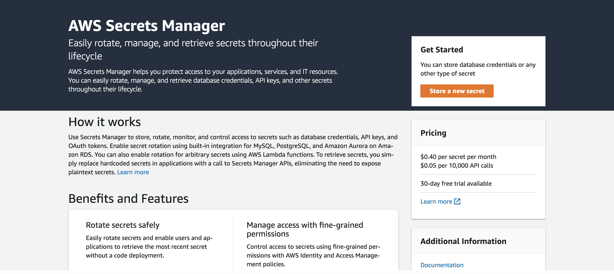
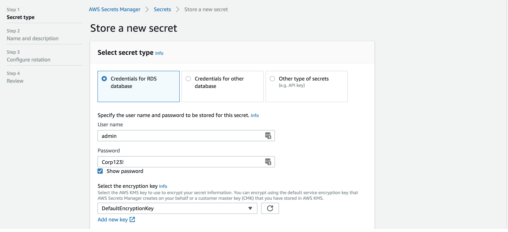
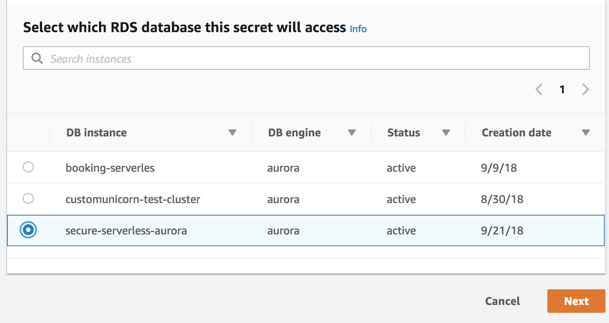
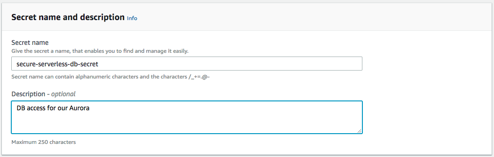
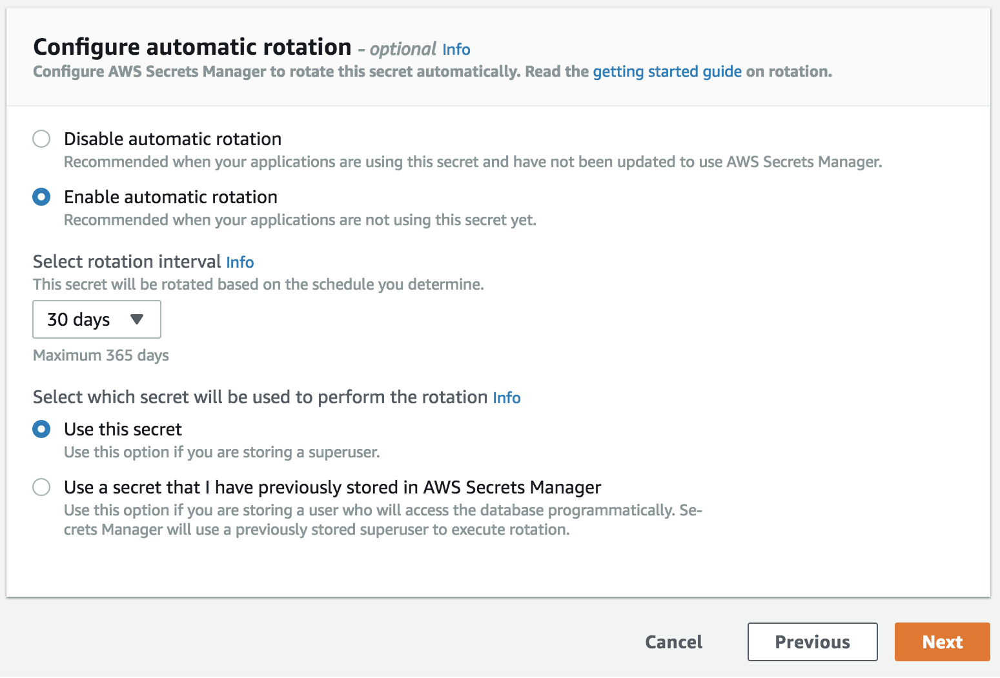
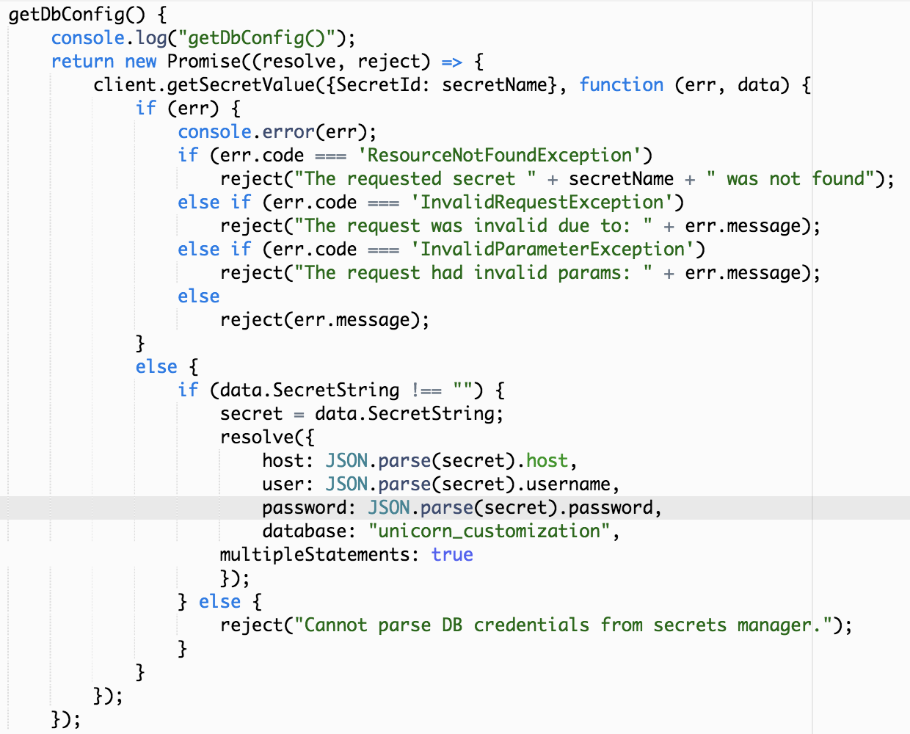

# Module 2: Securely storing our database credentials with AWS Secrets Manager

Hardcoding database's credentials and connection information is not a best practice. Not only from a security point of view but also operational. Any data breach within your code could expose these secrets and expose your business critical data. You also risk accidentally making your credentials public if you check in your code into a public repo or a private repo that can be accessed by a wide range of people. 

From an operational perspective, when deploying your code between different stages in your CI/CD pipelines, hardcoded values make it difficult to automate and might require manual intervention slowing down your development process.

During this section we will use AWS Secrets Manager to handle our database credentials for us. Besides keeping your database safe even if people get access to read your code, AWS Secrets Manager also integrates with RDS and will automatically handle password rotations. 

> Once you decide to do this module, you won't be able to use Cloud9 Local testing as we haven't configured the correct permissions to test locally this functionality.

## Module 2A: Create a secret in AWS Secrets Manager

First thing we need to do is create a secret in Secrets Manager.
 
1. Go to your AWS Console to AWS Secrets Manager.
	
1. Click on *Store a new secret*.
2. Select ***Credentials for RDS database*** type of secret. Fill it with these values:
	- Username: `admin`
	- Password: `Corp123!`
	- Select the encryption key: `DefaultEncryptionKey`.
	
	- Select your Aurora cluster (starts with `secure-serverless-aurora`)

		
	
1. Click on *Next* and continue fill the wizard with the following values.
	- Secret name: `secure-serverless-db-secret`
	- Description: Use an optional description here.
	
1. Again, click on *Next* and configure your rotation.
	- Click on `Enable Rotation`
	- Select `30 Days` as the rotation interval.
	- Choose **Create a new Lambda Function to perform rotation**
	- Give the lambda function a name, e.g. `aurora-rotation`
	- Select **Use this secret** 
	
1. Then, click *Next* and, if you want, review the example code. During the next sections we will modify our code to use Secrets Manager and this code will be used as an example.
1. Finally, click *Store*.

> Be careful if you are using Firefox or Chrome extensions when performing these steps! Some extensions like *LastPass* might change the values entered before.

## Module 2B: Add permission to Lambda function to read from secrets manager

We need to modify the execution policy on the lambda functions, so they areallowed to make API calls to Secrets Manager. 

In `template.yaml`, look for the block below that defines policies for Secrets Manager (**You should find a total 3 occurrences**) and uncomment them. 

```yaml
#        - Version: '2012-10-17'
#          Statement:
#            - Effect: Allow
#              Action:
#                - "secretsmanager:GetSecretValue"
#              Resource: "*"

```


&#9888; **Note: ENSURE YOU REPLACE ALL 3 OCCURRENCES**!  &#9888;  

Also, note that in the **Globals** section we are referencing the name of the secret

```
Globals:
  Function:
    Timeout: 30
    Environment:
      Variables:
        SECRET_NAME: secure-serverless-db-secret # name of the RDS credentials in secrets manager

```

## Module 2C: Modify your code to use the secret

Once you have have created the secret, you will have to modify the application code to use Secrets Manager. Go to the file `src/app/dbUtils.js`. Here is where the connection information is stored.

At the beginning of the file, add the following lines to create the required variables to use AWS Secrets Manager. You can add them just after the line `const PARTNER_COMPANY_TABLE = "Companies";`.

```javascript
// Load the AWS SDK
const AWS = require('aws-sdk');
const secretName = process.env.SECRET_NAME;
var secret;

// Create a Secrets Manager client
const client = new AWS.SecretsManager();
```

Taking a look at this code you might notice that we are using Environment Variables. To see where these variables are defined, go to `template.yaml` and check on *Global*. These have been defined from the beginning. Verify that they follow the previous step work.

Now, it's time to modify how we set the configuration of our connection to the database. The method that does this is called **getDbConfig** within *dbUtils.js*.
This method returns a [promise](http://google.com) resolving with the JSON parameters.

```javascript
            resolve({
                host: host,
                user: "admin",
                password: "Corp123!",
                database: "unicorn_customization",
                multipleStatements: true
            });

```

 Replace the lines above with the following code:

```javascript
            client.getSecretValue({SecretId: secretName}, function (err, data) {
                if (err) {
                    console.error(err);
                    if (err.code === 'ResourceNotFoundException')
                        reject("The requested secret " + secretName + " was not found");
                    else if (err.code === 'InvalidRequestException')
                        reject("The request was invalid due to: " + err.message);
                    else if (err.code === 'InvalidParameterException')
                        reject("The request had invalid params: " + err.message);
                    else
                        reject(err.message);
                }
                else {
                    if (data.SecretString !== "") {
                        secret = data.SecretString;
                        resolve({
                            host: JSON.parse(secret).host,
                            user: JSON.parse(secret).username,
                            password: JSON.parse(secret).password,
                            database: "unicorn_customization",
	                    multipleStatements: true
                        });
                    } else {
                        reject("Cannot parse DB credentials from secrets manager.");
                    }
                }
            });

```
Here is an example of how the method should look after the changes.



If you read the code closely, you will see that is gathering the secrets from AWS Secrets Manager service and use them to resolve the promise with the values returned by the service.

## Module 2D: Deploy and test

Now it's time to deploy again and test the application:

1. Validate the template:

	```
	sam validate -t template.yaml
	```
	
1.  Deploy the updates by running:

	```
	 aws cloudformation package --output-template-file packaged.yaml --template-file template.yaml --s3-bucket $BUCKET --s3-prefix securityworkshop --region $REGION &&  aws cloudformation deploy --template-file packaged.yaml --stack-name CustomizeUnicorns --region $REGION --capabilities CAPABILITY_IAM --parameter-overrides InitResourceStack=Secure-Serverless
	```


1. Test the API using postman. You can test it with whatever method in the API such as `/socks`, `/horns`...

## Extra credit

**Cache the secrets:**
The code currently makes a call to Secrets Manager to retrieve the secret every time the Lambda function gets invoked. This may generate lots of API calls to Secrets Manager when your API is being invoked frequently. 
To reduce network traffic to Secrets Manager, you can take advantage of [Execution Context reuse](https://aws.amazon.com/blogs/compute/container-reuse-in-lambda/) and cache the secret value. 

## Next Step 

Return to the workshop [landing page](../../README.md) to pick another module.
