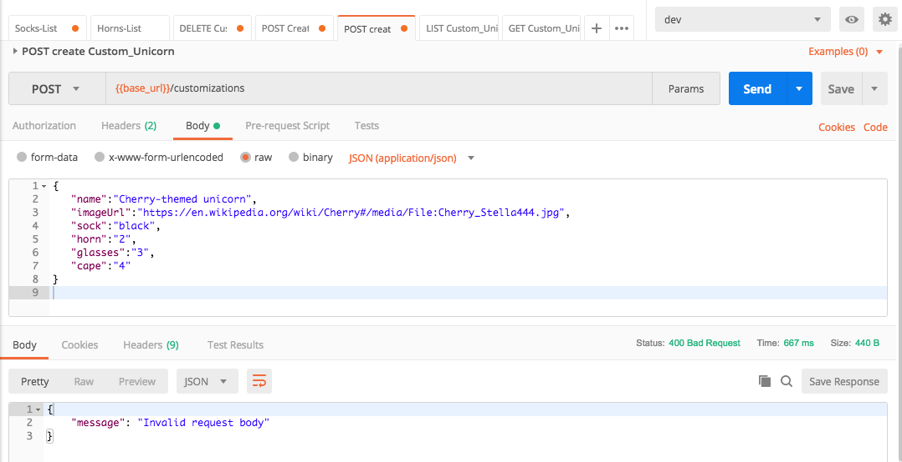

# Module 3: Input validation on API Gateway

A quote from the OWASP website: 

> "*The most common web application security weakness is the failure to properly validate input from the client or environment*."
> 
>  --- [**OWASP** (The Open Web Application Security Project)](https://www.owasp.org/index.php/Data_Validation)

You can configure API Gateway to perform basic validation of an API request before proceeding with the integration request. When the validation fails, API Gateway immediately fails the request, returns a 400 error response to the caller, and publishes the validation results in CloudWatch Logs. This reduces unnecessary calls to the backend. More importantly, it lets you focus on the validation efforts specific to your application.

For example, in our application, when defining an customization, we have to be sure that our new customization should have:

 - A **company** id
 - An url for the cape's **image** .
 - A type of **socks** for our unicorn specified by an id.
 - A specific id for the **horn** to use.
 - An id for the pair of **glasses**.
 - A type of **cape** by id.

This information should be on our request to create a new customization regardless if that company exist, those glasses are available or the image is present at the moment.

This means that, on our API Gateway we will ensure that every request trying to create a new customization has a value (numeric or URL) for it no matter if those values are real or good. That is what you should focus on in your application. 

## Module 3A: Create a model for your Customizations

In API Gateway, a [**model**](https://docs.aws.amazon.com/apigateway/latest/developerguide/models-mappings.html#models-mappings-models) defines the data structure of a payload, using the [JSON schema draft 4](https://tools.ietf.org/html/draft-zyp-json-schema-04).

When we define our model, we can ensure that the parameters we are receiving are in the format we are expecting. Furthermore, you can check them against regex expressions. A good tool to test if your regex is correct is [regexr.com](https://regexr.com/). 

For our **POST /customizations** API, we are going to use the following model:

```json
{
  "title": "Customizations",
  "$schema": "http://json-schema.org/draft-04/schema#",
  "type": "object",
  "required": [
    "imageUrl",
    "sock",
    "horn",
    "glasses",
    "cape",
    "name"
  ],
  "properties": {
    "imageUrl": {
      "type": "string",
      "title": "The Imageurl Schema",
      "pattern": "https?:\/\/[-a-zA-Z0-9@:%_+.~#?&//=]+"
    },
    "name": {
      "type": "string",
      "title": "The name Schema",
      "pattern": "[a-zA-Z0-9- ]+"
    },
    "sock": {
      "type": "string",
      "title": "The Sock Schema",
      "pattern": "[0-9]+"
    },
    "horn": {
      "type": "string",
      "title": "The Horn Schema",
      "pattern": "[0-9]+"
    },
    "glasses": {
      "type": "string",
      "title": "The Glasses Schema",
      "pattern": "[0-9]+"
    },
    "cape": {
      "type": "string",
      "title": "The Cape Schema",
      "pattern": "[0-9]+"
    }
  }
}
```

Now, follow these steps:

1. Go to API Gateway console.
2. Click on the API **CustomizeUnicorns**
3. Click on **Models**
4. Click on **Create** and create a model with the following values:
	- Model name: `CustomizationPost`
	- Content type: `application/json`
1. In the model schema, use the one provided before (the *json* before this section).
1. Once everything is filled, click on **Create model**.
	
	![Create model] (images/06_api_model.png)

Once we have created our model, we need to apply it to our customizations/post method.

1. Within the API Gateway Console, click on CustomizeUnicorns, **Resources**
2. Click under /customizations --> **POST** method

	
1. Click on **Method Request**
2. Under **Request Validator**, click on the pencil to edit it. Select **Validate Body**. Then, click on the tick to confirm the change.
3. Under **Request Body**, click on **Add model** with the following values:
	- Content type: `application/json`
	- Model name: `CustomizationPost`
4. Click to the tick to confirm.

	![Method Execution] (images/06_method_execution.png)
	
On step number 2 you might have notice that we can also validate QueryStrings and body + query  strings. This is really useful when our application uses both at the same time and we want to have complex validations. If you want to find more information, [here] (https://docs.aws.amazon.com/apigateway/latest/developerguide/api-gateway-method-request-validation.html) is our documentation about this.

Now it's time to deploy and test! Go to the Actions menu and click on **Deploy API**. Select `dev` as the *Deployment stage* and confirm by clicking **Deploy**.

## Module 3B: Test your Validation

Use postman, you can try making requests to the **POST /customizations** API using invalid parameters and see the input validation kick in: 

### Wrong parameters = Invalid request:

Here are some example request bodies that fail:

* The `imageUrl` not a valid URL: 

	```javascript
	{  
	   "name":"Cherry-themed unicorn",
	   "imageUrl":"htt://en.wikipedia.org/wiki/Cherry#/media/File:Cherry_Stella444.jpg",
	   "sock":"1",
	   "horn":"2",
	   "glasses":"3",
	   "cape":"4"
	}
	```

* The `sock ` parameter not a number: 

	```javascript
	{  
	   "name":"Cherry-themed unicorn",
	   "imageUrl":"https://en.wikipedia.org/wiki/Cherry#/media/File:Cherry_Stella444.jpg",
	   "sock":"black",
	   "horn":"2",
	   "glasses":"3",
	   "cape":"4"
	}
	```

You should get a 400 Bad Request response: 

```javascript
{"message": "Invalid request body"}
```



### Correct parameters

Testing the API with right parameters:

```javascript
{  
   "name":"Cherry-themed unicorn",
   "imageUrl":"https://en.wikipedia.org/wiki/Cherry#/media/File:Cherry_Stella444.jpg",
   "sock":"1",
   "horn":"2",
   "glasses":"3",
   "cape":"4"
}
```


The result should be:

```bash
{"customUnicornId":<the-id-of-the-customization>}
```

## You want more? 

There is, at least, one more method that needs to be validated. Build your own json schema for that method and apply the same steps mentioned before and you should be able to validate these methods as well!

<details>
<summary><strong>In case you need some help, here is the model to be used:</strong></summary>

```json
{
  "title": "ParameterPOST",
  "$schema": "http://json-schema.org/draft-04/schema#",
  "type": "object",
  "required": [
    "name"
  ],
  "properties": {
    "name": {
      "type": "string",
      "title": "Partner Schema",
      "pattern": "^(.*)$"
    }
  }
}
```
</details>

## Next step 
You have now added basic input validation to your API and further reduced the risk of attackers using bad inputs to sabotage your API! 

Return to the workshop [landing page](../../README.md) to pick another module.
