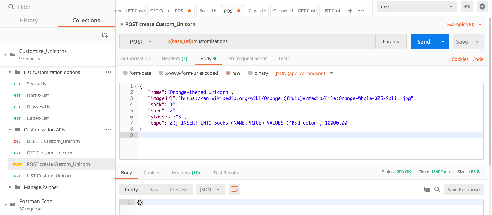
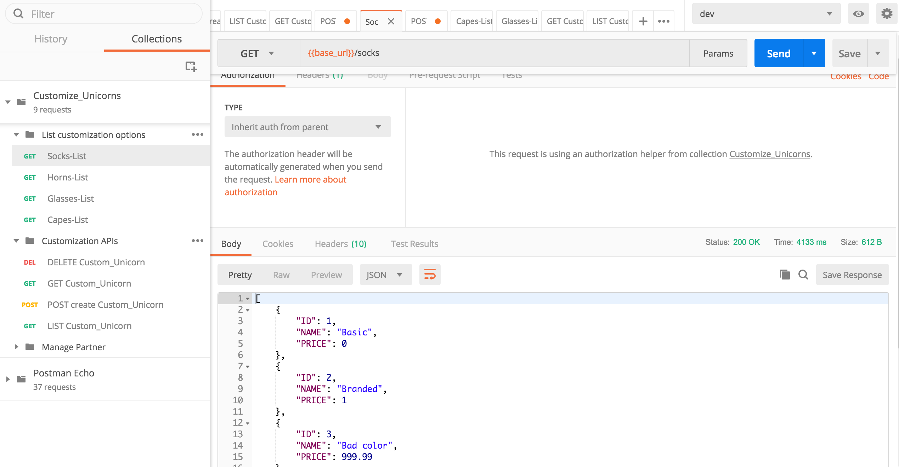
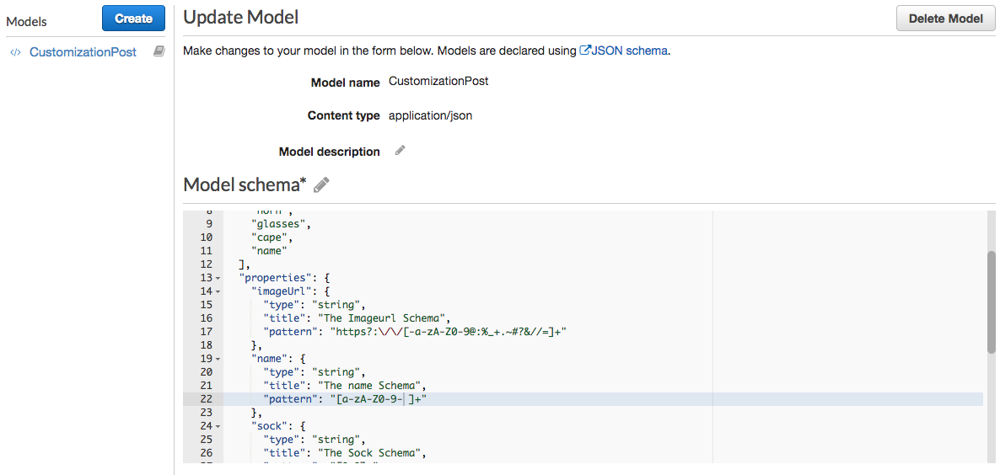
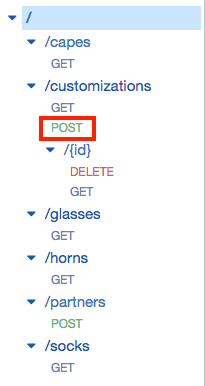
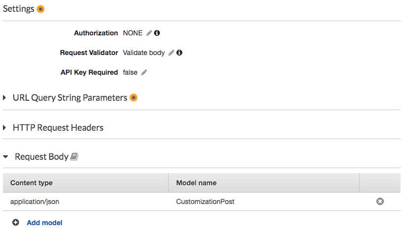

# Module 3: Input validation on API Gateway

A quote from the OWASP website: 

> "*The most common web application security weakness is the failure to properly validate input from the client or environment*."
> 
>  --- [**OWASP** (The Open Web Application Security Project)](https://www.owasp.org/index.php/Data_Validation)

A great [XKCD comic](https://xkcd.com/327/) demonstrate this point well: 


You can configure API Gateway to perform basic validation of an API request before proceeding with the integration request. When the validation fails, API Gateway immediately fails the request, returns a 400 error response to the caller, and publishes the validation results in CloudWatch Logs. This reduces unnecessary calls to the backend. More importantly, it lets you focus on the validation efforts specific to your application.

For example, in our application, when defining an customization, we have to be sure that our new customization should have:

 - A **name** for the customization object 
 - An url for the cape's **image** .
 - A type of **socks** for our unicorn specified by an id.
 - A specific id for the **horn** to use.
 - An id for the pair of **glasses**.
 - A type of **cape** by id.

This information should be in our request body to create a new customization that follows specific patterns.  E.g. the imageUrl should be a valid URL, the IDs for socks and horns are numeric values. 

By leveraging input validation on API Gateway, you can enforce required parameters and regex patterns each parameter must adhere to. This allows you to remove boilerplate validation logic from backend implementations and focus on actual business logic and deep validation.

## Module 3 - Optional: attack your API with SQL injection! 

If you haven't completed **Module 6: WAF**, your serverless API is currently vulnerable to SQL injection attacks. This optional module shows how you can perform the attack. 

<details>
<summary><strong>Click to expand for optional step instructions </strong></summary>


If you look at our lambda function code right now, no input validation is being performed, and with the below line specified as part of our mysql client setting (under `/src/app/dbUtils.js`):  

```
                multipleStatements: true

```

> **Note**: As a best practice you should set the `multipleStatements` option to false in your code (the nodejs mysql client actually defaults it false). However, this is not disabled by default in all programming languages/libraries, so we enabled it in our starter code for you to see the easiness of this attack.

we can easily embed SQL statements in the body of the request to get executed. For example, in the body of the POST customizations/ API, try using the below:

<details>
<summary><strong> If you have done module 1, use sample input here </strong></summary>
	
```
{  
   "name":"Orange-themed unicorn",
   "imageUrl":"https://en.wikipedia.org/wiki/Orange_(fruit)#/media/File:Orange-Whole-%26-Split.jpg",
   "sock":"1",
   "horn":"2",
   "glasses":"3",
   "cape":"2); INSERT INTO Socks (NAME,PRICE) VALUES ('Bad color', 10000.00"
}
```
	
</details>

<details>
<summary><strong>If you have not done module 1, use sample input here </strong></summary>
	
```
{  
   "name":"Orange-themed unicorn",
   "imageUrl":"https://en.wikipedia.org/wiki/Orange_(fruit)#/media/File:Orange-Whole-%26-Split.jpg",
   "sock":"1",
   "horn":"2",
   "glasses":"3",
   "cape":"2); INSERT INTO Socks (NAME,PRICE) VALUES ('Bad color', 10000.00",
   "company":"1"
}
```
	
</details>




Send the request using Postman. If the request succeeds, you have now just performed a SQL injection attack! 

If you look at the SQL injection statement we just performed, it's adding a bad value into the `Socks` table. We can verify that took effect by running the **GET /socks** API:



</details>

## Module 3A: Create a model for your Customizations

In API Gateway, a [**model**](https://docs.aws.amazon.com/apigateway/latest/developerguide/models-mappings.html#models-mappings-models) defines the data structure of a payload, using the [JSON schema draft 4](https://tools.ietf.org/html/draft-zyp-json-schema-04).

When we define our model, we can ensure that the parameters we are receiving are in the format we are expecting. Furthermore, you can check them against regex expressions. A good tool to test if your regex is correct is [regexr.com](https://regexr.com/). 

For our **POST /customizations** API, we are going to use the following model:

```json
{
  "title": "Customizations",
  "$schema": "http://json-schema.org/draft-04/schema#",
  "type": "object",
  "required": [
    "imageUrl",
    "sock",
    "horn",
    "glasses",
    "cape",
    "name"
  ],
  "properties": {
    "imageUrl": {
      "type": "string",
      "title": "The Imageurl Schema",
      "pattern": "^https?:\/\/[-a-zA-Z0-9@:%_+.~#?&//=]+$"
    },
    "name": {
      "type": "string",
      "title": "The name Schema",
      "pattern": "^[a-zA-Z0-9- ]+$"
    },
    "sock": {
      "type": "string",
      "title": "The Sock Schema",
      "pattern": "^[0-9]*$"
    },
    "horn": {
      "type": "string",
      "title": "The Horn Schema",
      "pattern": "^[0-9]*$"
    },
    "glasses": {
      "type": "string",
      "title": "The Glasses Schema",
      "pattern": "^[0-9]*$"
    },
    "cape": {
      "type": "string",
      "title": "The Cape Schema",
      "pattern": "^[0-9]*$"
    }
  }
}
```

Now, follow these steps:

1. Go to API Gateway console.
2. Click on the API **CustomizeUnicorns**
3. Click on **Models**
4. Click on **Create** and create a model with the following values:
	- Model name: `CustomizationPost`
	- Content type: `application/json`
1. In the model schema, use the one provided before (the *json* before this section).
1. Once everything is filled, click on **Create model**.
	
	

Once we have created our model, we need to apply it to our customizations/post method.

1. Within the API Gateway Console, click on CustomizeUnicorns, **Resources**
1. Click under /customizations --> **POST** method

	
1. Click on **Method Request**
1. Under **Request Validator**, click on the pencil to edit it. Select **Validate Body**. Then, click on the tick to confirm the change.
1. Under **Request Body**, click on **Add model** with the following values:
	- Content type: `application/json`
	- Model name: `CustomizationPost`
1. Click to the tick to confirm.

	
	
	> On step number 2 you might have noticed that we can also validate query parameters and request headers in addition to request body. This is really useful when our application uses both at the same time and we want to have complex validations. If you want to find more information, [here](https://docs.aws.amazon.com/apigateway/latest/developerguide/api-gateway-method-request-validation.html) is our documentation about this.

	1. Now it's time to deploy and test! Go to the **Actions** menu and click on **Deploy API**. Select `dev` as the **Deployment stage** and confirm by clicking **Deploy**.

## Module 3B: Test your Validation

Use postman, you can try making requests to the **POST /customizations** API using invalid parameters and see the input validation kick in (if you get an unauthorize error message, could be caused by the expiration time of the Authentication token. You can easily refresh rthis token following these steps from module [01](../01-add-authentication/README.md#1E): 

### Wrong parameters = Invalid request:

Here are some example request bodies that fail:

* Missing fields: 

	```javascript
	{  
	   "name":"Cherry-themed unicorn",
	   "imageUrl":"https://en.wikipedia.org/wiki/Cherry#/media/File:Cherry_Stella444.jpg",
	   "glasses": "3",
	   "cape": "4"
	}
	```

* The `imageUrl` not a valid URL: 

	```javascript
	{  
	   "name":"Cherry-themed unicorn",
	   "imageUrl":"htt://en.wikipedia.org/wiki/Cherry#/media/File:Cherry_Stella444.jpg",
	   "sock": "1" ,
	   "horn": "2" ,
	   "glasses": "3",
	   "cape": "4"
	}
	```

* The `cape ` parameter not a number (SQL injection attempt)

	```javascript
	{  
	   "name":"Orange-themed unicorn",
	   "imageUrl":"https://en.wikipedia.org/wiki/Orange_(fruit)#/media/File:Orange-Whole-%26-Split.jpg",
	   "sock": "1",
	   "horn": "2",
	   "glasses": "3",
	   "cape":"2); INSERT INTO Socks (NAME,PRICE) VALUES ('Bad color', 10000.00"
	}

	```


You should get a 400 Bad Request response: 

```javascript
{"message": "Invalid request body"}
```


### Correct parameters

Testing the **POST /customizations** API with right parameters:

<details>
<summary><strong> If you have done module 1, use sample input here </strong></summary>

```javascript
{  
   "name":"Cherry-themed unicorn",
   "imageUrl":"https://en.wikipedia.org/wiki/Cherry#/media/File:Cherry_Stella444.jpg",
   "sock": "1",
   "horn": "2",
   "glasses": "3",
   "cape": "4"
}
```
</details> 

<details>
<summary><strong> If you have not done module 1, use sample input here </strong></summary>

```javascript
{  
   "name":"Cherry-themed unicorn",
   "imageUrl":"https://en.wikipedia.org/wiki/Cherry#/media/File:Cherry_Stella444.jpg",
   "sock": "1",
   "horn": "2",
   "glasses": "3",
   "cape": "4",
   "company" : "1"
}
```
</details> 


The result should be:

```bash
{"customUnicornId":<the-id-of-the-customization>}
```

## Additional input validation options

As you have now seen, API Gateway input validation gives you basic features such as type checks and regex matching. In a production application, this is often not enough and you may have additional constraints on the API input. 

To gain further protection, you should consider using the below in addition to the input validation features from API Gateway:

* Add an AWS WAF ACL to your API Gateway - check out [**Module 6**](../06-waf/)
* Add further input validation logic in your lambda function code itself 


## Extra credit

There is, at least, one more method that needs to be validated. Build your own json schema for that method and apply the same steps mentioned before and you should be able to validate these methods as well!

<details>
<summary><strong>Hint: In case you need some help, here is the model to be used:</strong></summary>

```json
{
  "title": "PartnerPOST",
  "$schema": "http://json-schema.org/draft-04/schema#",
  "type": "object",
  "required": [
    "name"
  ],
  "properties": {
    "name": {
      "type": "string",
      "title": "Partner Schema",
      "pattern": "^[a-zA-Z0-9- ]+$"
    }
  }
}
```
</details>

## Next step 
You have now added basic input validation to your API and further reduced the risk of attackers using bad inputs to sabotage your API! 

Return to the workshop [landing page](../../README.md) to pick another module.
