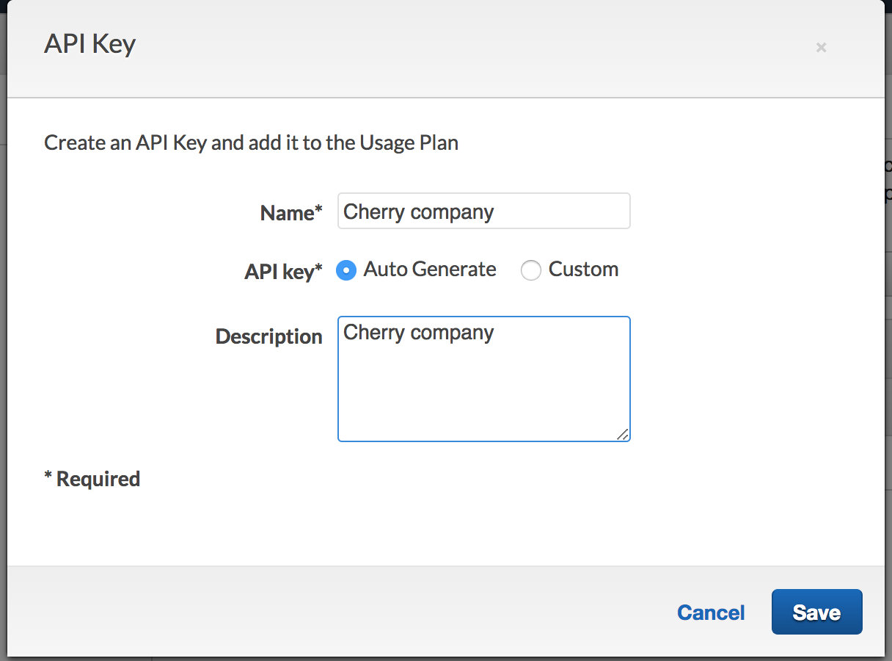

# Module 5: Usage Plan

You can leverage Usage Plans with Amazon API Gateway to set limits on request rate for consumers of your API to protect it from being abused by a particular misbehaving client. 

To tally the number of requests based on the caller, API Gateway uses API Keys to keep track of different consumers for your API. In our use case, requests coming from different companies can be calculated separately. 

## Module 5A: Create an API Gateway usage plan 
1. In the API Gateway console, go to **Usage Plans** tab, and click **Create** 
1. Fill in the details for the usage plan 
	
	* **Name**: ```Basic```
	* **Description** : ```Basic usage plan for Unicorn customization partners```
	* **Enable throttling**: check yes
	* **Throttling Rate** : ```1``` request per second
	* **Throttling Burst** : 1 
	* **Enable Quota**: check yes and use ```100``` requests per ```month```

	
	
	Click **Next**
	
1. Associate the API we created previously with the usage plan. Pick `dev` stage. And click the checkmark to confirm. Then click **Next**

	


1. We currently don't have any API keys set up. 	In this step, click **Create API Key and add to Usage Plan** to create an API key for the partner company 

	<details>
	<summary><strong> If you have not done module 1, expand for instructions here </strong></summary>

	* For Name, pick any name e.g.  `cherry company`. 
	* For API Key, select **Auto Generate**
	* Click **Save**


	
	</details> 
	
	<details>
	<summary><strong> If you have done module 1, expand for instructions here </strong></summary>
	
	For our application, we are going to reuse the value of the ClientID of the customer as the value for the API Key, to keep down the number of random strings that customers have to remember. 
	
	* For Name, use the company name you created in **Module 1: Auth**. 
	* For API Key, select **Custom** so we can import the value
	* In the inputbox that comes up, use the same value as the ClientID of the company (if you forgot it, you can retrieve it from the Cognito console and look under **App clients** tab
	* Click **Save**
	
	

	</details> 


	
1. After the API key has been created, click **Done**. 

	
	
## Module 5B: Update API Gateway to enforce API keys

Now, we need to modify our API gateway so requests must have an API key present.

	
<details>
<summary><strong> If you have done module 1, expand for instructions here </strong></summary>


1. In the API swagger definition in `template.yaml`, add the below lines to add an additional type of AWS security: 

	```yaml
	      ApiKey:
            type: apiKey
            name: x-api-key
            in: header
	```
	
	

1. Next, for the APIs in the Swagger template for customizing unicorns and listing customization options (leave out the `/partners` APIs for now), add the below 

	```yaml
         		- ApiKey: []
	```
	to the `security` section in each API:

	

</details>

<details>
<summary><strong> If you have not done module 1, expand for instructions here </strong></summary>


1. In the API swagger definition in `template.yaml`, find the line:

	```
	### TODO: add authorizer
	```
	
	add the following lines below that: 

	```yaml
	        securityDefinitions:
	          ApiKey:
	            type: apiKey
	            name: x-api-key
	            in: header
	```

	See screeenshot: 
	
	
	&#9888; **Caution: Ensure the `securityDefinitions` section you pasted is at the same indentation level as `info` and `paths`** &#9888;


1. In the `paths` section of the Swagger template, change the occurrence of each of the below
	
	```yaml
	#              security:
	#                - CustomAuthorizer: []
	
	```

	into
	
	```yaml
	              security:
	                - ApiKey: []
	```
	
	See screeenshot: 
	

	&#9888; **Caution: Ensure all 9 APIs are updated** &#9888;
	
</details>

Now, deploy the changes and verify: 

1. Validate the template in the terminal:

	```
	sam validate -t template.yaml
	```

1.  Deploy the updates:

	```
	 aws cloudformation package --output-template-file packaged.yaml --template-file template.yaml --s3-bucket $BUCKET --s3-prefix securityworkshop --region $REGION &&  aws cloudformation  deploy --template-file packaged.yaml --stack-name CustomizeUnicorns --region $REGION --parameter-overrides InitResourceStack=Secure-Serverless --capabilities CAPABILITY_IAM
	```

1. Once the deployment completes, you can go the [API Gateway console](https://console.aws.amazon.com/apigateway/home), navigate to the **CustomizeUnicorns API** -> **Resources** --> Pick an method --> click on **Method Request**. 

	You should now see the **API Key Required** field set to `true`

	


## Module 5C: Test request with API keys

1. Go back to Postman. Now the API is enforcing API keys, the request will fail if you don't include the API key header. 

	Try sending an request using Postman like you did before. You should see the request fail with a **403 Forbidden** status code and a `{"message": "Forbidden"}` response. 
	
	> If the response is **401 Unauthorized** and if you have completed module 1, most likely your access token is expired. Use Postman to request a new access token and try again.

1. You can add the API key request header by going to the **Header** tab, and put in 
	* `x-api-key` for the header key
	* The value for the API Key that we added to the usage plan in module 5B:
		* If you have done module 1: this should be same as the Cognito app Client ID
		* If you have not done module 1: you can find the auto-generated API key value by going to the **API Keys** tab in the API gateway console --> click on the API key you created in module 5B --> click **Show** next to **API Key**	


			 

	You should now see the request go through
	
	 


## Module 5D (Optional): Use the Lambda authorizer to provide the API key


&#9888; **Caution: This optional module assumes you have completed Module 1** &#9888;

If you have already completed module 1: to make the API consumer's life easier, instead of forcing them to add a separate `x-api-key` header to the request they are making, we can make API Gateway take the API Key from the lambda authorizer. Read more about the two sources of API keys supported by API gateway [here](https://docs.aws.amazon.com/apigateway/latest/developerguide/api-gateway-api-key-source.html)

To make this work:

1. In the API swagger definition in template.yaml, add the below lines
	
	```
	x-amazon-apigateway-api-key-source: AUTHORIZER
	```
	
  	to the same level as the `securityDefinitions` or `paths` field: 
  	
	 
	
1. We also need to make the Lambda authorizer return the API Key as part of the auth response. To do so, go to `authorizer/index.js`, find the following line in the code, and uncomment the second line:  

                        // Uncomment here to pass on the client ID as the api key in the auth response
                        // authResponse.usageIdentifierKey = payload["client_id"];

1. Validate the SAM template:

	```
	sam validate -t template.yaml
	```

1.  Deploy the updates:

	```
	 aws cloudformation package --output-template-file packaged.yaml --template-file template.yaml --s3-bucket $BUCKET --s3-prefix securityworkshop --region $REGION &&  aws cloudformation  deploy --template-file packaged.yaml --stack-name CustomizeUnicorns --region $REGION --parameter-overrides InitResourceStack=Secure-Serverless --capabilities CAPABILITY_IAM
	```

1. Once the deployment finishes, test making API requests again with postman. You should now be able to remove the `x-api-key` request header and the request should be able to succeed. 


## Module 5E (Optional): Test throttling behavior with postman

&#9888; **Caution: This optional module assumes you have completed Module 1 and Module 5D! If you have not done those two, you would need to add the x-api-key header to each of the API in the collection first!** &#9888;

You can use postman to send multiple API requests in sequence. 

1. In postman, click on **Runner**

1. Pick the `List customization options` folder to run

1. Select the `dev` environment and set runner to run 10 iterations

	

1. In the test result, you should some requests getting throttled and receiving a 429 response:

	


## Extra credit

If you want extra credit (karma points), here are some ideas:

* Try viewing/downloading the usage data for a given client. 
	
	> **Hint**: See [here](https://docs.aws.amazon.com/apigateway/latest/developerguide/api-gateway-create-usage-plans-with-console.html#api-gateway-usage-plan-manage-usage) on some documentation 

* Try configure different throttling thresholds for different API methods

	> **Hint**: See [here](https://docs.aws.amazon.com/apigateway/latest/developerguide/api-gateway-request-throttling.html#apig-request-throttling-stage-and-method-level-limits) on some documentation 

## Next Step 
You have now configured throttling for your API consumers using API Gateway Usage Plans! 

Return to the workshop [landing page](../../README.md) to pick another module.