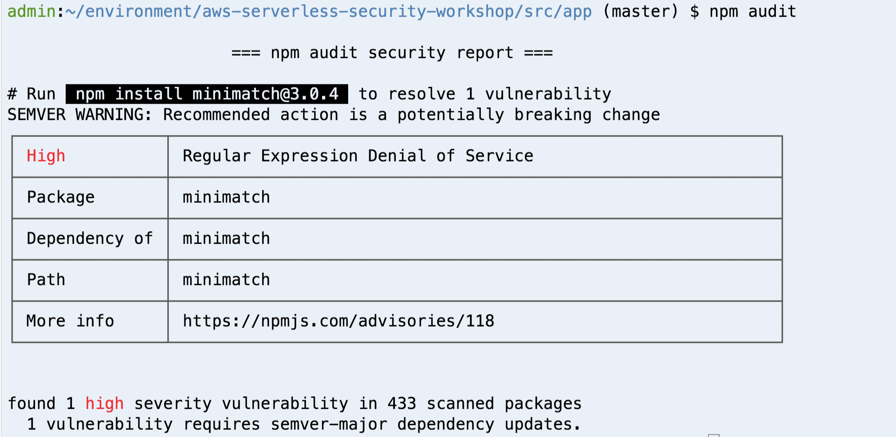

# Module 7: Dependency Vulnerability 

When building modern applications, it is common to use different libraries, modules and, in general, different dependencies. Even if we are including a simple dependency, we could end up with tens or even hundreds of sub-dependencies. Just take a look at this page:

- [http://npm.anvaka.com/#!/view/2d/request](http://npm.anvaka.com/#!/view/2d/request)

A simple module used by several applications like *request* could end up with 60 links! If you never thought about the impact a single vulnerable dependency can have, take a look at this [story](https://www.theregister.co.uk/2016/03/23/npm_left_pad_chaos/). 

In this module, we will cover finding and removing publicly disclosed vulnerable dependencies. There are different tools that can help monitor dependency vulnerabilities. Depending on the programming language, below are some example tools to look into: 

- [npm-audit](https://docs.npmjs.com/cli/audit)
- [OWASP Dependency Check](https://www.owasp.org/index.php/OWASP_Dependency_Check) 
- [Snyk](https://snyk.io/)
- [Puresec](https://www.puresec.io) 
- [Twistlock](https://www.twistlock.com/)
- [Protego](https://www.protego.io/)

During this workshop we will use the first one to review our code.

## Dependency vulnerability with *npm audit*

The tooling for dependency vulnerability checking may vary for different programming languages. With NodeJS, vulnerability checking is now a feature shipped with the `npm` package manager itself after npm acquired NSP (Node Security Platform). 

Running `npm audit` command will produce a report of security vulnerabilities, and if available, commands to apply patches to resolve vulnerabilities. In fact `npm audit` automatically runs when you install a package with `npm install`. 


1. In the cloud9 environment, go to the node application directory where `package-lock.json` is:
	
	```
	cd ~/environment/aws-serverless-security-workshop/src/app
	```	
	
1. Run the vulnerability audit:

	```
	npm audit
	```	
	
	You should see something like this: 
	
	
 
So it turns out the `minimatch:2.0.10` dependency has a known vulnerability.  Reading the link on the security advisory in the report can give you more detail on how it can be exploited.
	
Before we attempt to patch this dependency as suggested by the report, we should ask first: is the application even using *minimatch*? This library compares two different expressions against regular expressions to find out if they match. 

In fact, our application is not even using the library thus we should remove it. This can often happen in software projects when a library got pulled into the code base to experiment with something, but later the code evolved and that dependency is no longer required. 

But how do we know for sure which dependencies are we using and which ones not so we can safely remove unused dependencies?

### Removing unused dependencies using static analysis

We will install another tool to review our code and report which dependencies are included in our code and are not being used. Maybe they were used in a previous point in time, but not anymore.

1. Run the following command to install [depcheck](https://www.npmjs.com/package/depcheck?activeTab=readme):

	```bash
	npm install -g depcheck
	```

2. Run the tool with the following commands:

	```bash
	cd ~/environment/aws-serverless-security-workshop/src/app/
	depcheck
	```

	The result should be something like this:
	
	```bash
	$ depcheck
	Unused dependencies
	* babel-core
	* babel-plugin-transform-flow-strip-types
	* babel-preset-es2017
	* minimatch
	Missing dependencies
	* aws-sdk
	```
	
	Therefore, to mitigate this, we should remove these dependencies. Run the following commands:
	
	```bash
	npm uninstall babel-core --save
	npm uninstall babel-preset-es2017 --save
	npm uninstall minimatch --save
	npm uninstall babel-plugin-transform-flow-strip-types --save
	```

You may also have noticed that there are some **missing dependencies**! This is because we are using the `aws-sdk` package already installed in the [AWS Lambda runtime](https://docs.aws.amazon.com/lambda/latest/dg/current-supported-versions.html)

To be sure we removed unused dependencies, run `depcheck` again.

Now your code is free of vulnerabilities from the dependency perspective!

> These steps should be part of your CI/CD pipeline and implemented to be run on every deployment.

## Extra credit

Before October 2019, we used to recommend a free tool called [Puresec Function Shield](https://www.puresec.io/function-shield)

It performs additional runtime protection of your lambda function:

* If not required, block outbound network traffic from your function.
* Disable `/tmp` if it's not used
* Disable the ability to launch child processes from within the Lambda container.

However, it's no longer being maintained as of October 2019 and the project incorporated into a commercial product (see [https://github.com/puresec/FunctionShield](https://github.com/puresec/FunctionShield) )

To look at other commercial product offerings in this area, check out the [Lambda security partner page](https://aws.amazon.com/lambda/partners/?partner-solutions-cards.sort-by=item.additionalFields.partnerName&partner-solutions-cards.sort-order=asc&awsf.partner-solutions-filter-partner-type=use-case%23security-identity-compliance)

## Next Step 

Return to the workshop [landing page](../../README.md) to pick another module.

