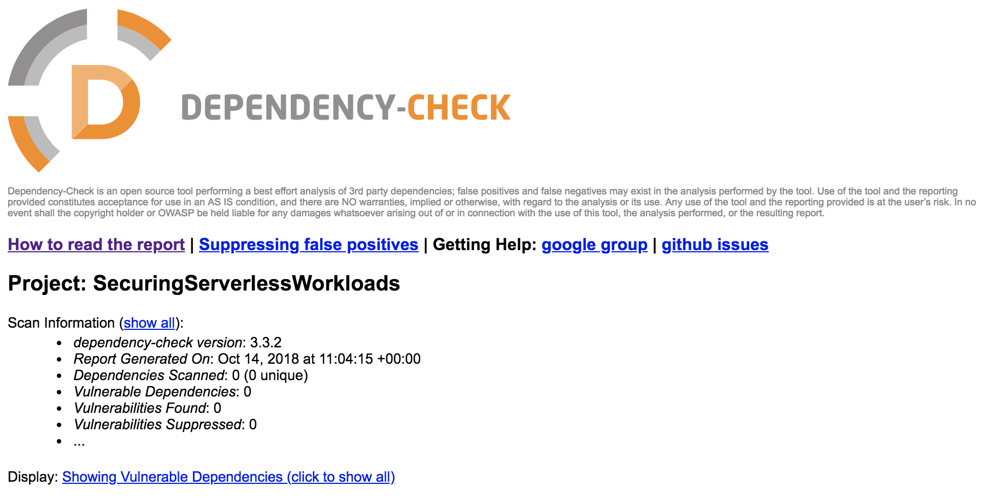
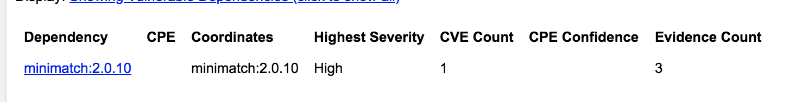

# Module 7: Dependency Vulnerability 

When building modern applications, it is common to use different libraries, modules and, in general, different dependencies. Even if we are including a simple dependency could end up with tens or even hundreds of subdependencies. Just take a look at this page:

- [http://npm.anvaka.com/#/view/2d/request](http://npm.anvaka.com/#/view/2d/request)

A simple module used by several applications like *request* could end up with 60 links! If you want to know what is the impact of your dependencies, take a look at this [story](https://www.theregister.co.uk/2016/03/23/npm_left_pad_chaos/). However, during this workshop we will cover finding and removing publicly vulnerable dependencies. In order to do it, you can use different tools to find out if your dependencies have known vulnerabilities. Some of these tools are:

- [OWASP Dependency Check](https://www.owasp.org/index.php/OWASP_Dependency_Check)
- [Node nsp](https://github.com/nodesecurity/nsp)
- [Puresec](https://www.puresec.io) 
- [Twistlock](https://www.twistlock.com/)
- [Snyk](https://snyk.io/)
- [Protego](https://www.protego.io/)

During this workshop we will use the first one to review our code.

## Dependency vulnerability with *OWASP Dependency Check*

**dependency-check** is a utility that identifies project dependencies and checks if there are any known, publicly disclosed, vulnerabilities. Currently, Java and .NET are supported; additional experimental support has been added for Ruby, Node.js, Python, and limited support for C/C++ build systems (autoconf and cmake). To start, go to your Cloud9 environment.

### Downloading the latest java jdk

**dependency-check** needs Java 1.8.0 to be able to download the latest version of the dependencies database. To do so, run the following commands to install them and delete the previous one. If the latest command (exec bash) doesn't work, close the terminal and start a new one.

```bash
sudo yum install java-1.8.0 -y
sudo yum remove java-1.7.0-openjdk -y
exec bash
export JAVA_HOME=/usr/lib/jvm/java-1.8.0-openjdk-1.8.0.191.b12-0.42.amzn1.x86_64/jre
```

Since the bash terminal is restarted, also run the below to set your environment variables again:

```
REGION=<your_region>
BUCKET=secure-serverless-deploymentss3bucket-<bucket>
```

You can find the S3 bucket name following these steps:

	* In a separate browser tab, go to the CloudFormation console at `https://console.aws.amazon.com/cloudformation/home`
	* Select `Secure-Serverless` stack.
	* In the **Output** tab, take note of **DeploymentS3Bucket**

### Downloading the tool

Now we are going to download the tool:

1. In the terminal and run the following command:

```bash
cd ~/environment
``` 
2. Download the dependency check tool and unzip it by running these commands:

```bash
wget -O dependency-check-3.3.2-release.zip http://dl.bintray.com/jeremy-long/owasp/dependency-check-3.3.2-release.zip
unzip dependency-check-3.3.2-release.zip
rm dependency-check-3.3.2-release.zip
```

### Reading package.json. Running the tool

The tool will generate an HTML file with a report of the vulnerability scan once it has finished. The tool reviews your *package.json* file and researches for known vulnerabilities against it's vulnerabilities database. 

If we take a look at our package.json we will see something the following dependencies:

```json
"dependencies": {
    "babel-core": "*",
    "babel-plugin-transform-flow-strip-types": "*",
    "babel-preset-es2017": "*",
    "minimatch": "^2.0.10",
    "mysql": "^2.16.0"
  }
```

Now, let's run the tool to find out if we are finding any vulnerability:

```bash
cd ~/environment/dependency-check/bin/
sh dependency-check.sh --project "SecuringServerlessWorkloads" --scan ~/environment/aws-serverless-security-workshop/src/app/
```

This process takes some time. It will review your code against their vulnerability database. You should see something like this on the output:

```bash
youruser:sh dependency-check.sh --project "SecuringServerlessWorkloads" --scan ~/environment/aws-serverless-security-workshop/src/app/

[INFO] Checking for updates
[INFO] starting getUpdatesNeeded() ...
[INFO] NVD CVE requires several updates; this could take a couple of minutes.
[INFO] Download Started for NVD CVE - 2002
[INFO] Download Started for NVD CVE - 2003
[INFO] Download Complete for NVD CVE - 2002  (2797 ms)
[INFO] Download Started for NVD CVE - 2004
[INFO] Processing Started for NVD CVE - 2002
[INFO] Download Complete for NVD CVE - 2003  (3413 ms)
[INFO] Download Started for NVD CVE - 2005
				...
[INFO] Finished Vulnerability Suppression Analyzer (0 seconds)
[INFO] Finished Dependency Bundling Analyzer (0 seconds)
[INFO] Analysis Complete (5 seconds)
```

### Reading the report

In the **Environment** panel, Under *Secure-Serverless-Cloud9 > dependency-check > bin* you will find a file called **dependency-check-report.html** Right click on it and select **preview**. This will open the html file for your to review it.



As you can see (intentionally) we have included a dependency that is vulnerable. The report shows it!



minimatch:2.0.10 it's a dependency that has a known dependency. More specifically:

> Affected versions of `minimatch` are vulnerable to regular expression denial of service attacks when user input is passed into the `pattern` argument of `minimatch(path, pattern)`.
	
If you keep scrolling down in the report you can find details about this vulnerability and find out how attackers could exploit it.

But the real question is, are we using *minimatch*? This library compares two different expressions against regular expressions to find out if they match. 

In fact, our application is not using the library thus we should remove it. But how do we know for sure which dependencies are we using and which ones not?

### Removing unused dependencies using static analysis

We will install another tool to review our code and report which dependencies are included in our code and are not being used. Maybe they were used in the past but not anymore.

1. Run the following command to install [depcheck](https://www.npmjs.com/package/depcheck?activeTab=readme):

```bash
npm install -g depcheck
```

2. Run the tool with the following commands:

```bash
cd ~/environment/aws-serverless-security-workshop/src/app/
depcheck
```

The result should be something like this:

```bash
Unused dependencies
* babel-core
* babel-plugin-transform-flow-strip-types
* babel-preset-es2017
* minimatch
Missing dependencies
* aws-sdk
```

Therefore, to mitigate this, we should remove these dependencies. Run the following commands:

```bash
npm uninstall babel-core --save
npm uninstall babel-preset-es2017 --save
npm uninstall minimatch --save
npm uninstall babel-plugin-transform-flow-strip-types --save
```

You also notice that there are some missing dependencies! This is because we are using the packages already installed in the [AWS Lambda runtime](https://docs.aws.amazon.com/lambda/latest/dg/current-supported-versions.html)

To be sure we removed unused dependencies, run depcheck again.

Now your code is free of vulnerabilities from the dependency side!

> These steps should be part of your CI/CD pipeline and implemented to be run on every deployment.

## Extra credit

If you want extra credit (even **MORE** karma points), here is a good method:

<details>
<summary><strong>Click here to find out more about Function Shield </strong></summary><p>

Doing Vulnerability checks before the code is released is a minimum bar. In order to achieve better security posture, you can further prevent vulnerabilities from within your own code! Which ones?

* If not required, block outbound network traffic from your function.
* Disable `/tmp` if it's not used
* Disable the ability to launch child processes from within the Lambda container.

Luckily for you, this could be easily achievable with the free library produced by [Puresec](https://www.puresec.io/function-shield)


For an extra point, use this library to alert and/or block these features from within your Lambda Function.

Here is some *'malicious code'* you can use:

```javascript
var sys = require('sys');
var exec = require('child_process').exec;
```

And within your handler:

```javascript
var dir = exec("echo 'I'm a malicious code", function(err, stdout, stderr) {
    console.log(stdout);
});
    
dir.on('exit', function (code) {
    //Do something
});
```

Try to block your executions and review CloudWatch logs to find out the output!

</details>

## Next Step 

Return to the workshop [landing page](../../README.md) to pick another module.

