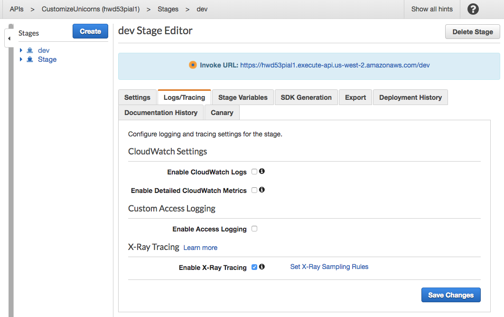
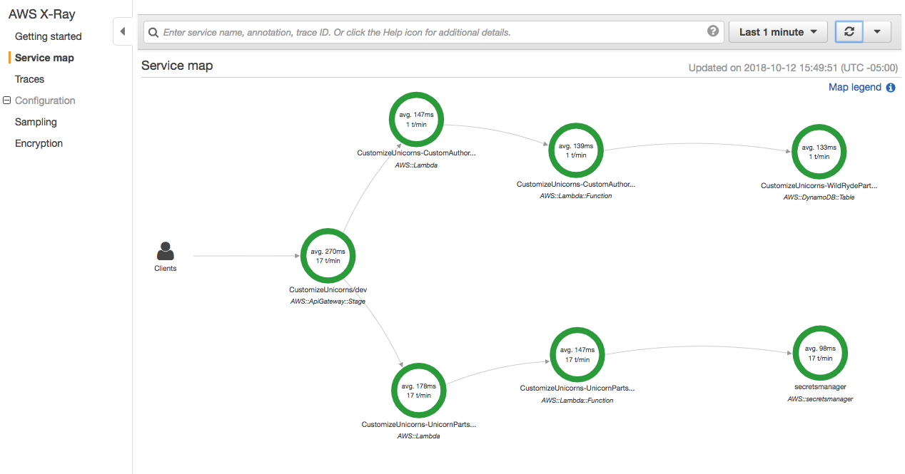
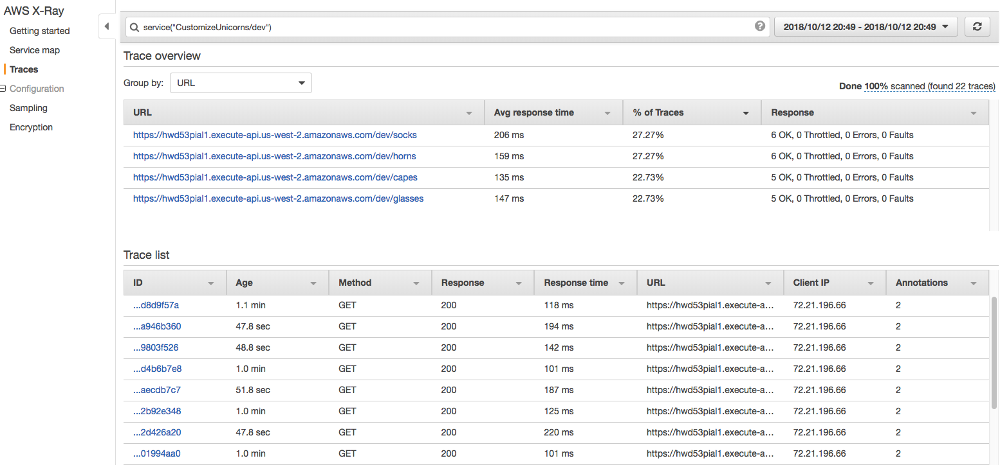
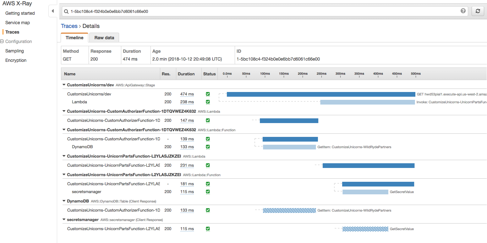

# Module 8: AWS X-Ray

"Insufficient Logging & Monitoring" is one of the Top 10 Application Security Risks ranked by [OWASP](https://www.owasp.org/index.php/Main_Page) in 2017. 

AWS X-Ray gives you visibility into the data flow of your microservices architecture and a map of how your application’s underlying components are connected. It's a great tool to troubleshoot performance and debug errors. However, given the ephemeral nature of the infrastructure in a serverless application, this visibility into your application is also critical for the purpose of security:

* It helps you understand the "norm" of the data flow, interdependencies, and performance characteristics of your distributed serverless components. Knowing that is a prerequisite of recognoizing when things are not normal. 
* During an security incident or post analysis, X-Ray can give you insights into what your code is doing at runtime, what downstream dependency it's making calls to, where the code is spending its time
 
## Module 8A: Enable X-Ray for Lambda function


In the Cloud9 IDE environment, go to the SAM template (`template.yaml`), find the [**Globals**](https://github.com/awslabs/serverless-application-model/blob/master/docs/globals.rst) section, which contains settings that all resources in the SAM template share unless explicitly overwritten. 

```
Globals:
  Function:
    Timeout: 30
    ...
```
	
Add `Tracing: Active` to the configuration section for lambda functions:
	
```
Globals:
  Function:
    Timeout: 30
    Tracing: Active
    ...
```

## Module 8B: Capturing AWS SDK requests with XRay

When our applications makes calls to AWS services such as Secrets Manager, DynamoDB, S3 etc., the X-Ray SDK can help tracks the calls downstream and record the request timing, status, etc. about the AWS Service call. 

To enable this, you can instrument all AWS SDK clients by wrapping your `aws-sdk` require statement in a call to `AWSXRay.captureAWS`
	
### Capturing AWS SDK requests in the Lambda authorizer
	
The Lambda authorizer you added in [**Module 1: Auth**](../01-add-authentication) uses the AWS SDK to look up values from a DynamoDB table. We can instrument the AWS SDK with X-Ray:

1. Install the XRay SDK in the `authorizer/` folder by running in a terminal

	```bash
	cd	~/environment/aws-serverless-security-workshop/src/authorizer 
	npm install aws-xray-sdk-core --save
	```
	
1. In `authorizer/index.js`, find the line where the AWS SDK is imported: 

	```javascript
	const AWS = require('aws-sdk');
	```
	
	And replace it with:
	
	```javascript
	const AWSXRay = require('aws-xray-sdk-core');
	const AWS = AWSXRay.captureAWS(require('aws-sdk'));
	```

### Capturing AWS SDK requests in the backend lambda functions

<details>
<summary><strong>If you haven't gone through Module 2: Secrets </strong></summary><p>

The backend lambda functions currently doesn't use the AWS SDK, so no additional action needed! 

</details>

<details>
<summary><strong>If you have gone through Module 2: Secrets </strong></summary><p>

If you have gone through [**Module 2: Secrets**](../02-add-secrets-manager), you would have added the AWS SDK to `dbUtils.js` so the code would retrieve the database username and password from [**AWS Secrets Manager**](https://aws.amazon.com/secrets-manager/)

1. Install the XRay SDK in the `app/` folder by running in a terminal

	```bash
	cd	~/environment/aws-serverless-security-workshop/src/app 
	npm install aws-xray-sdk-core --save
	```
	
1. In `app/dbUtils.js`, find the line where the AWS SDK is imported: 

	```javascript
	const AWS = require('aws-sdk');
	```
	
	And replace it with:
	
	```javascript
	const AWSXRay = require('aws-xray-sdk-core');
	const AWS = AWSXRay.captureAWS(require('aws-sdk'));
	```


</details>


## Module 8C: Deploy lambda changes and test

1. In the terminal, validate the SAM template:

	```
	cd	~/environment/aws-serverless-security-workshop/src/
	sam validate -t template.yaml
	```

1.  Deploy the updates:

	```
	 aws cloudformation package --output-template-file packaged.yaml --template-file template.yaml --s3-bucket $BUCKET --s3-prefix securityworkshop --region $REGION &&  aws cloudformation  deploy --template-file packaged.yaml --stack-name CustomizeUnicorns --region $REGION --parameter-overrides InitResourceStack=Secure-Serverless --capabilities CAPABILITY_IAM
	```

1. Once the deployment finishes, test making API requests again with postman. 

1. Go to the [**X-Ray console**](https://console.aws.amazon.com/xray/home), go to the **Service map** tab and refresh. You should start seeing some lambda requests getting captured! 


## Module 8D: Enable X-Ray on API Gateway

1. Go to [API Gateway Console](https://.console.aws.amazon.com/apigateway/home), and go to the `CustomizeUnicorns` API

1. Go to the **Stages** tab, click on the `dev` stage

1. Find the **Logs/Tracing** tab, check the box for **Enable X-Ray Tracing**, and **Save changes** 

	
	
1. Redeploy the API by clicking on the **Resources** tab on the left hand side --> **Actions**  --> **Deploy API**  -> Pick the `dev` stage --> **deploy**. 

1. Test making a few making API requests with postman. 

1. Go to the [**X-Ray console**](https://console.aws.amazon.com/xray/home), go to the **Service map** tab and refresh 

	

1. Explore the service map. Click on various components, and use **View traces** to see a list of request traces captured by X-Ray 

	

1. Explore the individual traces by clicking into individual rquests

	


## Next Step 

Return to the workshop [landing page](../../README.md) to pick another module.
