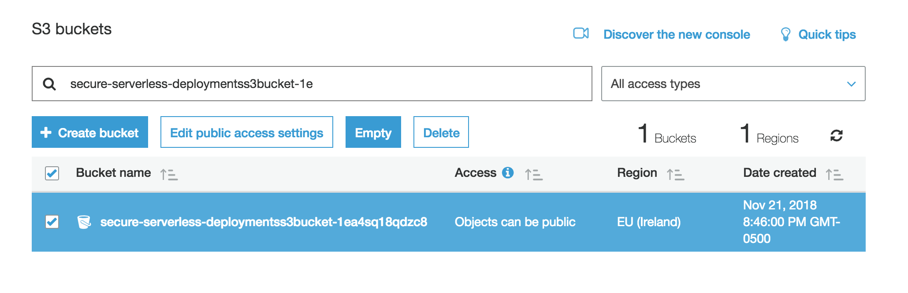

# Resource clean up

This page provides instructions for cleaning up the resources created during the preceding modules.

## Resource Cleanup Instructions

1. Delete Cognito User pool domain that you created if you created one in **Module 1: Auth**

	

	
<strong>Click here to expand for detailed instructions </strong>

	
	1. Go to the [Cognito Console](https://console.aws.amazon.com/cognito/home)
	1. Go to **Manage User Pools**
	1. Choose `CustomizeUnicorns-users` user pool
	1. Go to **Domain name** under **App integration**
	1. Click **Delete domain** 
	1. Confirm the deletion

	

1. Delete API Gateway Usage plan if you created one in **Module 5: Usage Plans**

	

	
<strong>Click here to expand for detailed instructions </strong>

	
	1. Go to the [API Gateway Console](https://console.aws.amazon.com/apigateway/home)
	1. Go to **Usage plans**
	1. Go to the `Basic` Usage Plan
	1. In the **Details** tab under **Associated API Stages**, remove the `CustomizeUnicorns` API
	1. On the upper right hand corner, click on **Actions** and choose **Delete Usage Plan**
 
	

1. Delete the secret from AWS Secrets Manager if you created one in **Module 2: Secrets**

	

	
<strong>Click here to expand for detailed instructions </strong>

	
	1. Go to the [Secrets Manager Console](https://console.aws.amazon.com/secretsmanager/home)
	1. Select the `secure-serverless-db-secret` secret
	1. In **Actions** select **Delete secret** 
	1. Enter `7` (minimum waiting period) for waiting period and click **Schedule deletion**

	

1. Delete the AWS WAF if you created one in **Module 6: WAF**

	

	
<strong>Click here to expand for detailed instructions </strong>

	
	1. Go to the [WAF Console](https://console.aws.amazon.com/waf/home)
	1. In the navigation pane, choose **Web ACLs**.
	1. Choose the `ProtectUnicorns` web ACL you created in the module 6
	1. On the **Rules** tab in the right pane, choose Edit web ACL.
	1. Remove all rules from the web ACL by choosing the **x** at the right of the row for each rule. This doesn't delete the rules from AWS WAF, it just removes the rules from this web ACL.
	1. Choose **Update**
	1. Dissasociate the API gateway from the WAF by going to the section **AWS resources using this web ACL** in the **Rules** tab and clicking the  **x** at the right of the API gateway stage
	1. On the **Web ACLs** page, confirm that the web ACL that you want to delete is selected, and then choose **Delete**.
 	1. In the navigation pane, choose **Rules**. 
	1. Go to each of the 3 rules we created, edit the rule to disassociate all the conditions for each rule
	1. Delete the rules
	1. Delete the 3 conditions we created in the workshop
	

1. Delete `CustomizeUnicorns` CloudFormation stack

	

	
<strong>Click here to expand for detailed instructions </strong>

	
	1. Go to the [CloudFormation Console](https://console.aws.amazon.com/cloudformation/home)
	1. Select the `CustomizeUnicorns` Stack
	1. Under **Actions**, choose **Delete Stack**
	
	

1. Empty the deployment s3 bucket:
	
	

	
<strong>Click here to expand for detailed instructions </strong>

	1. Go to the [S3 Console](https://console.aws.amazon.com/s3/home)
	1. Search for bucket starting with `secure-serverless-deploymentss3bucket`
	1. Click on the checkmark for the bucket and click on the **Empty** button

		
	
	1. Type in the bucket name to confirm the empty operation 
	

	
1. Delete the `Secure-Serverless` resource setup CloudFormation stack

1. CloudWatch Logs
AWS Lambda automatically creates a new log group per function in Amazon CloudWatch Logs and writes logs to it when your function is invoked. You should delete the log group for the lambda functions. (You can search for log groups starting with `/aws/lambda/CustomizeUnicorn` prefix. 

1. Delete the RDS snapshot of the aurora database in the RDS console
